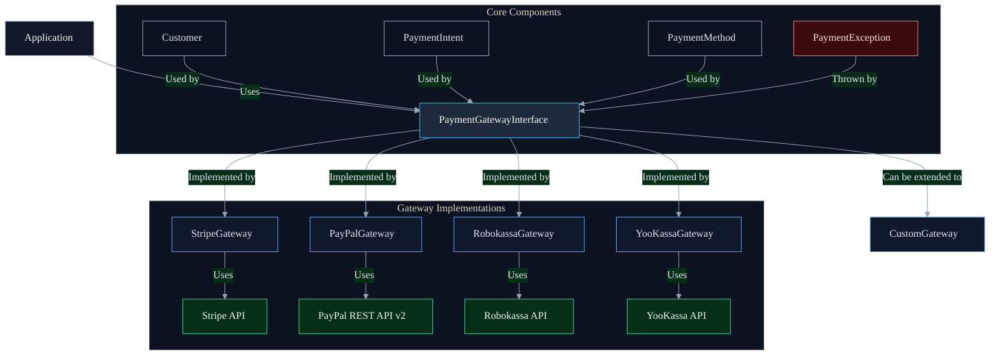
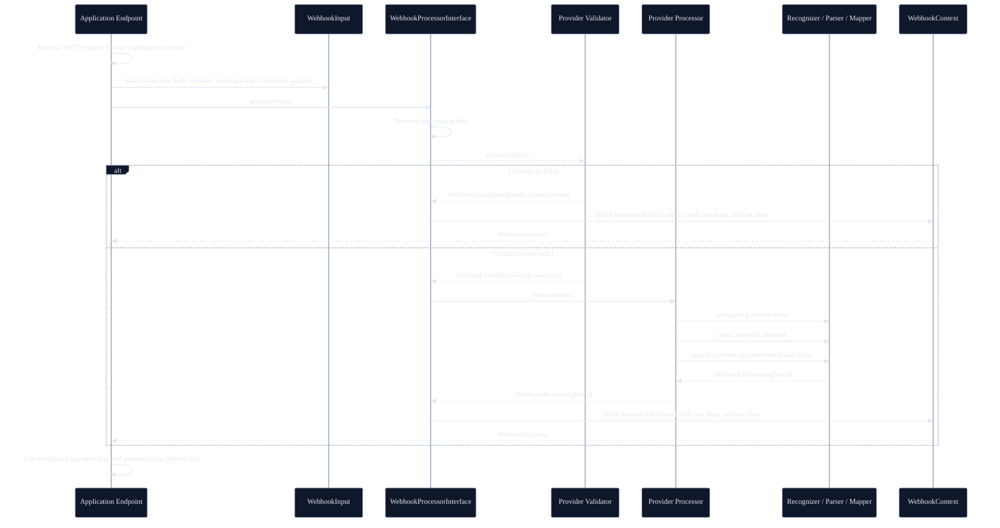

<p align="center">
    <a href="https://github.com/yiisoft" target="_blank">
        
    </a>
    <h1 align="center">Yii Payment Gateway</h1>
    <br>
</p>

[](https://packagist.org/packages/yiisoft/payments)
[](https://packagist.org/packages/yiisoft/payments)
[](https://github.com/yiisoft/payments/actions/workflows/build.yml?query=branch%3Ama)
[](https://codecov.io/gh/yiisoft/payments)
[](https://dashboard.stryker)
[](https://github.com/yiisoft/payments/actions/workflows/static.yml?query=branch)
[](https://shepherd.dev/github/yiisoft/payments)
[](https://shepherd.dev/github/yiisoft/payments)

A modern PHP 8.1+ library providing a unified interface for multiple payment gateways, with support for Stripe, PayPal (REST API v2), Robokassa and YooKassa.

## Requirements

- PHP 8.1 or higher.

## Installation

The package could be installed with [Composer](https://getcomposer.org):

```shell
composer require yiisoft/payments
```

## How it Works



The library provides a unified interface for multiple payment gateways, with each gateway implementing the `PaymentGatewayInterface`. The main components are:

- **PaymentGatewayInterface**: Defines the common API for all payment gateways
- **AbstractGateway**: Base class with shared functionality
- **Gateway-specific implementations**: `StripeGateway`, `PayPalGateway`, `RobokassaGateway`, `YooKassaGateway`
- **Data Models**: `Customer`, `PaymentIntent`, `PaymentMethod` for type-safe operations

## Features

- **Unified API** - Single interface for multiple payment providers
- **Type Safety** - Strictly typed models and responses
- **PSR Standards** - Follows PSR-4, PSR-7, PSR-17, and PSR-18
- **Extensible** - Easy to add new payment gateways
- **Modern PHP** - Requires PHP 8.1+ with strict types and readonly properties

## Payment Flow

### 1. Core Concepts

#### Customer
Represents a customer in the payment system. Contains:
- `id`: Unique identifier in the payment system
- `email`: Customer's email address
- `name`: Customer's full name
- `metadata`: Additional custom data

```php
$customer = new Customer(
    id: 'cus_123', // null for new customers
    email: 'customer@example.com',
    name: 'John Doe',
    metadata: ['user_id' => 42]
);
```

#### Payment Method
Represents how a customer will pay (credit card, PayPal, etc.). Contains:
- `id`: Unique identifier
- `type`: Payment method type (e.g., 'card', 'paypal')
- `details`: Payment method specific data (last4, brand, etc.)
- `customerId`: Reference to the customer
- `billingDetails`: Billing details (name, email, address, etc.)

```php
use Yiisoft\Payments\Models\PaymentMethod;
use Yiisoft\Payments\Models\PaymentMethodType;

$paymentMethod = new PaymentMethod(
    id: 'pm_123',
    type: PaymentMethodType::CARD,
    details: [
        'last4' => '4242',
        'brand' => 'visa',
        'exp_month' => 12,
        'exp_year' => 2025,
    ],
    customerId: 'cus_123',
    billingDetails: [
        'name' => 'John Doe',
        'email' => 'john.doe@example.com',
        'address' => [
            'line1' => '123 Main St',
            'city' => 'San Francisco',
            'state' => 'CA',
            'postal_code' => '94105',
            'country' => 'US',
        ],
    ],
);

// Available payment method types:
// - PaymentMethodType::CARD
// - PaymentMethodType::PAYPAL
// - PaymentMethodType::SEPA_DEBIT

// Check if a payment method type is valid
$isValid = PaymentMethodType::isValid('card'); // true

// Get all available payment method types
$allTypes = PaymentMethodType::all();
```

#### Payment Intent
Represents a single payment transaction. Contains:
- `id`: Unique identifier
- `amount`: Amount in smallest currency unit (e.g., cents)
- `currency`: 3-letter ISO currency code
- `status`: Current status (e.g., 'requires_payment_method', 'succeeded')
- `customerId`: Reference to the customer
- `paymentMethodId`: Reference to the payment method
- `metadata`: Additional custom data

```php
$intent = new PaymentIntent(
    id: 'pi_123', // null for new intents
    amount: 1000, // $10.00
    currency: 'usd',
    status: 'requires_payment_method',
    customerId: 'cus_123',
    paymentMethodId: 'pm_123',
    metadata: ['order_id' => 'abc123']
);
```

### 2. Payment Flow Steps

#### Step 1: Initialize the Gateway
```php
$gateway = new StripeGateway(
    apiKey: 'your_stripe_key',
    httpClient: $httpClient,
    requestFactory: $requestFactory,
    streamFactory: $streamFactory
);
```

#### Custom API endpoints

Each gateway has a small endpoints value object that allows overriding vendor base URLs (useful for stubs, proxies or alternative environments).

```php
use Yiisoft\Payments\Endpoints\StripeEndpoints;
use Yiisoft\Payments\Endpoints\PayPalEndpoints;
use Yiisoft\Payments\Endpoints\RobokassaEndpoints;
use Yiisoft\Payments\Endpoints\YooKassaEndpoints;

$stripe = new StripeGateway(
    apiKey: 'your_stripe_key',
    httpClient: $httpClient,
    requestFactory: $requestFactory,
    streamFactory: $streamFactory,
    endpoints: new StripeEndpoints(baseUri: 'https://proxy.example/stripe/v1'),
);

$paypal = new PayPalGateway(
    clientId: 'your_client_id',
    clientSecret: 'your_client_secret',
    sandbox: true,
    httpClient: $httpClient,
    requestFactory: $requestFactory,
    streamFactory: $streamFactory,
    endpoints: new PayPalEndpoints(
        sandboxBaseUri: 'https://api-m.sandbox.paypal.com',
        liveBaseUri: 'https://api-m.paypal.com',
    ),
);

$robokassa = new RobokassaGateway(
    merchantLogin: 'demo',
    password1: 'pass1',
    password2: 'pass2',
    password3: 'pass3',
    testMode: true,
    httpClient: $httpClient,
    requestFactory: $requestFactory,
    streamFactory: $streamFactory,
    endpoints: new RobokassaEndpoints(
        invoiceApiBaseUri: 'https://services.robokassa.ru/InvoiceServiceWebApi/api',
        refundApiBaseUri: 'https://services.robokassa.ru/RefundService/Refund',
        xmlApiBaseUri: 'https://auth.robokassa.ru/Merchant/WebService/Service.asmx',
    ),
);

$yookassa = new YooKassaGateway(
    shopId: 'your_shop_id',
    secretKey: 'your_secret_key',
    httpClient: $httpClient,
    requestFactory: $requestFactory,
    streamFactory: $streamFactory,
    endpoints: new YooKassaEndpoints(baseUri: 'https://api.yookassa.ru/v3'),
);
```

#### Step 2: Create or Retrieve Customer
```php
// Create new customer
$customer = $gateway->createCustomer(new Customer(
    email: 'customer@example.com',
    name: 'John Doe'
));

// Or retrieve existing customer
$customer = $gateway->retrieveCustomer('cus_existing123');
```

#### Step 3: Collect Payment Method (Frontend)
```javascript
// Example using Stripe.js
const { paymentMethod, error } = await stripe.createPaymentMethod({
  type: 'card',
  card: elements.getElement(CardElement)
});

// Send paymentMethod.id to your server
```

#### Step 4: Attach Payment Method (Server-Side)
```php
// If your frontend already created a payment method (e.g. via Stripe.js),
// you can simply attach it to the customer:
$paymentMethod = $gateway->attachPaymentMethod(
    $_POST['payment_method_id'],
    $customer->id,
);
```

#### Step 5: Create Payment Intent
```php
$intent = $gateway->createPaymentIntent(new PaymentIntent(
    amount: 1000, // $10.00
    currency: 'usd',
    customerId: $customer->id,
    paymentMethodId: $paymentMethod->id,
    metadata: ['order_id' => 'abc123']
));
```

#### Step 6: Confirm Payment (Client-Side)
```javascript
const { error, paymentIntent } = await stripe.confirmCardPayment(
  '{{ $intent->clientSecret }}',
  {
    payment_method: '{{ $paymentMethod->id }}',
    receipt_email: 'customer@example.com',
  }
);

if (error) {
  // Handle error
} else if (paymentIntent.status === 'succeeded') {
  // Payment succeeded!
}
```

#### Step 7: Webhooks (optional)
This library does not include webhook signature verification or event parsing.
Handle webhooks in your application using the provider's official documentation/SDK.


### 3. Handling Different Statuses

Payment Intents can have these statuses:
- `requires_payment_method`: Customer needs to add a payment method
- `requires_confirmation`: Payment needs to be confirmed
- `requires_action`: Customer needs to complete additional actions (3D Secure, etc.)
- `processing`: Payment is being processed
- `requires_capture`: Payment is authorized and needs to be captured
- `canceled`: Payment was canceled
- `succeeded`: Payment was successful

### 4. Refunds

```php
$refund = $gateway->createRefund('pi_123', [
    'amount' => 1000, // Optional: partial refund
    'reason' => 'requested_by_customer'
]);
```

### 5. Error Handling

Always wrap payment operations in try-catch blocks:

```php
try {
    $intent = $gateway->createPaymentIntent($paymentIntent);
} catch (PaymentException $e) {
    // Handle specific error types
    switch ($e->errorCode) {
        case 'card_declined':
            // Handle card decline
            break;
        case 'insufficient_funds':
            // Handle insufficient funds
            break;
        default:
            // Handle other errors
    }
}
```

## Usage

### Initializing a Gateway

The library relies on PSR-18 (HTTP client) and PSR-17 (request/stream factories).
In the examples below we use `symfony/http-client` and `nyholm/psr7`, but you can use any compatible implementations.

#### Stripe

```php
use Yiisoft\Payments\Gateways\StripeGateway;
use Symfony\Component\HttpClient\Psr18Client;
use Nyholm\Psr7\Factory\Psr17Factory;

$httpClient = new Psr18Client();      // Any PSR-18 client will work
$psr17Factory = new Psr17Factory();   // PSR-17 factories (request + stream)

$stripe = new StripeGateway(
    apiKey: 'YOUR_STRIPE_SECRET_KEY',
    httpClient: $httpClient,
    requestFactory: $psr17Factory,
    streamFactory: $psr17Factory,
);
```

#### PayPal (Checkout Orders API v2)

```php
use Yiisoft\Payments\Gateways\PayPalGateway;

// Reuse $httpClient and $psr17Factory from the Stripe example above (or provide your own PSR-18/PSR-17 implementations).
$paypal = new PayPalGateway(
    clientId: 'YOUR_CLIENT_ID',
    clientSecret: 'YOUR_CLIENT_SECRET',
    sandbox: true,
    httpClient: $httpClient,
    requestFactory: $psr17Factory,
    streamFactory: $psr17Factory,
);
```

#### Robokassa

```php
use Yiisoft\Payments\Gateways\RobokassaGateway;

// Reuse $httpClient and $psr17Factory from the Stripe example above (or provide your own PSR-18/PSR-17 implementations).
$robokassa = new RobokassaGateway(
    merchantLogin: 'YOUR_MERCHANT_LOGIN',
    password1: 'YOUR_PASSWORD_1', // Invoice API (JWT signing)
    password2: 'YOUR_PASSWORD_2', // XML status API (OpStateExt)
    password3: 'YOUR_PASSWORD_3', // Refund API v2 (JWT signing). Set to null if you don't need refunds.
    testMode: true,
    httpClient: $httpClient,
    requestFactory: $psr17Factory,
    streamFactory: $psr17Factory,
);
```


### Working with Customers

```php
use Yiisoft\Payments\Models\Customer;

// Create a customer
$customer = $gateway->createCustomer(new Customer(
    email: 'customer@example.com',
    name: 'John Doe',
    metadata: ['user_id' => 42],
));

// Retrieve a customer
$customer = $gateway->retrieveCustomer($customer->id);

// Update a customer (models are readonly, create a new instance)
$customer = $gateway->updateCustomer(new Customer(
    id: $customer->id,
    email: 'new.email@example.com',
    name: $customer->name,
    phone: $customer->phone,
    address: $customer->address,
    metadata: $customer->metadata,
    description: $customer->description,
));

// Delete a customer
$gateway->deleteCustomer($customer->id);
```

### Working with Payment Methods

```php
use Yiisoft\Payments\Models\PaymentMethod;
use Yiisoft\Payments\Models\PaymentMethodType;

// Note: payment method payload is gateway-specific.
// For card payments you should avoid handling raw card data on your server.
// Use provider tokenization (e.g. Stripe.js) whenever possible.

$paymentMethod = $gateway->createPaymentMethod(new PaymentMethod(
    type: PaymentMethodType::CARD,
    details: [
        // Example (Stripe): pass a token created on the client side.
        // The gateway will send it under the "card" key because type === "card".
        'token' => 'tok_visa',
    ],
    customerId: $customer->id,
));

$paymentMethod = $gateway->attachPaymentMethod($paymentMethod->id, $customer->id);
```

### Processing Payments

```php
use Yiisoft\Payments\Models\PaymentIntent;

// Create a payment intent / order / invoice (gateway-specific)
$intent = $gateway->createPaymentIntent(new PaymentIntent(
    amount: 1000,          // in the smallest currency unit (e.g. cents)
    currency: 'USD',
    customerId: $customer->id,
    paymentMethodId: $paymentMethod->id,
    description: 'Order #123',
    metadata: ['order_id' => '123'],
));

// Some gateways (PayPal, Robokassa) require a customer approval step via redirect URL:
$redirectUrl = $intent->nextAction['redirect_to_url']['url'] ?? null;

// Capture the payment (only for gateways/flows that support delayed capture)
if ($intent->status === PaymentIntent::STATUS_REQUIRES_CAPTURE) {
    $intent = $gateway->capturePaymentIntent($intent->id);
}

// Refund
$refund = $gateway->createRefund($intent->id, [
    'amount' => 1000, // optional partial refund
    'reason' => 'requested_by_customer',
]);
```

## Available Gateways

### Stripe (`StripeGateway`)

- Customers
- Payment Methods (create + attach)
- Payment Intents (create / retrieve / confirm / capture / cancel)
- Refunds

> Webhook verification/event parsing is intentionally out of scope for this library. Implement it in your application using Stripe docs/SDK.

### PayPal (`PayPalGateway`) — REST API v2 (Checkout Orders)

- Payment Intents are mapped to PayPal **Orders** (`/v2/checkout/orders`)
- `createPaymentIntent()` creates an order and may return an approval URL in `PaymentIntent::$nextAction['redirect_to_url']['url']`
- `capturePaymentIntent()` captures an order (`/v2/checkout/orders/{id}/capture`)
- `createRefund()` refunds a capture (`/v2/payments/captures/{capture_id}/refund`)

> PayPal does not expose generic Customer/PaymentMethod resources compatible with the library's models, so `Customer` / `PaymentMethod` operations are treated as lightweight placeholders (no persistent “vault” is created).

### Robokassa (`RobokassaGateway`)

- Payment Intents are mapped to Robokassa **invoices** (Invoice API JWT)
- `createPaymentIntent()` creates an invoice and returns a redirect URL in `PaymentIntent::$nextAction['redirect_to_url']['url']`
- `retrievePaymentIntent()` checks invoice status via **OpStateExt**
- `createRefund()` performs refund via **Refund API v2** (JWT)

> Robokassa customer/payment-method concepts differ from card processors, so `Customer` / `PaymentMethod` operations are implemented as placeholders for interface compatibility.

## Extending with New Gateways

To add a new payment gateway, create a class that implements `PaymentGatewayInterface`.
For convenience you can extend `Yiisoft\Payments\Gateways\AbstractGateway`, which provides:

- JSON request/response handling (PSR-18 + PSR-17)
- basic error-to-exception mapping (`PaymentException`, `InvalidRequestException`)
- a helper to build requests: `createRequest()`
- a helper to send and decode responses: `sendRequest()`

Example (minimal skeleton):

```php
<?php

declare(strict_types=1);

namespace App\Payment\Gateways;

use Yiisoft\Payments\Gateways\AbstractGateway;
use Yiisoft\Payments\Models\Customer;
use Yiisoft\Payments\Models\PaymentIntent;
use Yiisoft\Payments\Models\PaymentMethod;
use Psr\Http\Client\ClientInterface;
use Psr\Http\Message\RequestFactoryInterface;
use Psr\Http\Message\StreamFactoryInterface;

final class AcmePayGateway extends AbstractGateway
{
    public function __construct(
        private string $apiKey,
        ClientInterface $httpClient,
        RequestFactoryInterface $requestFactory,
        StreamFactoryInterface $streamFactory,
    ) {
        parent::__construct($httpClient, $requestFactory, $streamFactory);
    }

    protected function getBaseUri(): string
    {
        return 'https://api.acmepay.com/v1';
    }

    public function createCustomer(Customer $customer): Customer
    {
        $response = $this->sendRequest(
            $this->createRequest('POST', '/customers', [
                'email' => $customer->email,
                'name' => $customer->name,
            ])
        );

        return Customer::fromArray($response);
    }

    public function createPaymentIntent(PaymentIntent $intent): PaymentIntent
    {
        $response = $this->sendRequest(
            $this->createRequest('POST', '/payment_intents', [
                'amount' => $intent->amount,
                'currency' => $intent->currency,
                'metadata' => $intent->metadata,
            ])
        );

        return PaymentIntent::fromArray($response);
    }

    // Implement the remaining methods from PaymentGatewayInterface...
    public function retrieveCustomer(string $customerId): Customer { /* ... */ }
    public function updateCustomer(Customer $customer): Customer { /* ... */ }
    public function deleteCustomer(string $customerId): void { /* ... */ }
    public function createPaymentMethod(PaymentMethod $paymentMethod): PaymentMethod { /* ... */ }
    public function attachPaymentMethod(string $paymentMethodId, string $customerId): PaymentMethod { /* ... */ }
    public function confirmPaymentIntent(string $intentId, array $params = []): PaymentIntent { /* ... */ }
    public function capturePaymentIntent(string $intentId, array $params = []): PaymentIntent { /* ... */ }
    public function cancelPaymentIntent(string $intentId, array $params = []): PaymentIntent { /* ... */ }
    public function createRefund(string $paymentIntentId, array $params = []): array { /* ... */ }
    public function retrievePaymentIntent(string $intentId): PaymentIntent { /* ... */ }
}
```


### How to use it

After implementing your gateway (for example, `AcmePayGateway` above), you can use it exactly like the built-in gateways.
Instantiate it with a PSR-18 HTTP client and PSR-17 factories, then call the methods defined by `PaymentGatewayInterface`:

```php
<?php

declare(strict_types=1);

use App\Payment\Gateways\AcmePayGateway;
use Yiisoft\Payments\Models\Customer;
use Yiisoft\Payments\Models\PaymentIntent;

// $httpClient: PSR-18 client
// $requestFactory: PSR-17 request factory
// $streamFactory: PSR-17 stream factory

$gateway = new AcmePayGateway($httpClient, $requestFactory, $streamFactory);

// 1) (Optional) Create a customer in the provider
$customer = $gateway->createCustomer(new Customer(
    email: 'buyer@example.com',
    name: 'Buyer',
));

// 2) Create a payment intent (amount is in minor units, e.g. cents)
$intent = $gateway->createPaymentIntent(new PaymentIntent(
    amount: 1999,
    currency: 'USD',
    customerId: $customer->id,
    metadata: ['order_id' => 'ORDER-1001'],
));

// 3) If the provider requires buyer approval via redirect, send the buyer to:
$approvalUrl = $intent->nextAction['redirect_to_url']['url'] ?? null;

// 4) Later (after approval), confirm / capture (if your gateway uses these steps)
$intent = $gateway->confirmPaymentIntent($intent->id);
$intent = $gateway->capturePaymentIntent($intent->id);

// 5) Refund (full or partial, depending on your gateway constraints)
$refund = $gateway->createRefund($intent->id, ['amount' => 1999]);
```

#### Minimal required methods

`PaymentGatewayInterface` requires implementing **all** methods below:

- Customer: `createCustomer()`, `retrieveCustomer()`, `updateCustomer()`, `deleteCustomer()`
- Payment methods: `createPaymentMethod()`, `attachPaymentMethod()`
- Payment intents: `createPaymentIntent()`, `retrievePaymentIntent()`, `confirmPaymentIntent()`, `capturePaymentIntent()`,
  `cancelPaymentIntent()`
- Refunds: `createRefund()`

For a gateway that only supports *payments + refunds* (and does not have a customer / payment-method concept), the minimum
you typically implement with real provider calls is:

- `createPaymentIntent()`, `retrievePaymentIntent()`, `cancelPaymentIntent()`, `createRefund()`
- plus `confirmPaymentIntent()` / `capturePaymentIntent()` **if** your provider has a multi-step confirmation/capture flow

Customer and payment-method operations can be implemented as no-ops (returning the input model) or by throwing
`PaymentException` if the provider does not support them. Document that behavior in README.


Best practices:

1. Throw `PaymentException` (or subclasses) on any gateway-side errors.
2. Use idempotency keys where the provider supports them.
3. Add unit tests with a fake/spy HTTP client, and integration tests with real credentials (optional).
4. Document any gateway-specific behavior (approval redirects, delayed capture, refund constraints).

## Documentation

- [Internals](docs/internals.md)

If you need help or have a question, the [Yii Forum](https://forum.yiiframework.com/c/yii-3-0/63) is a good place
for that. You may also check out other [Yii Community Resources](https://www.yiiframework.com/community).

## Testing

Unit tests:

```bash
vendor/bin/phpunit
```

Integration tests (PayPal / Robokassa real API exchange):

1) Install dev dependencies
2) Copy config templates and fill credentials:

```bash
cp tests/config/paypal.php.dist tests/config/paypal.php
cp tests/config/robokassa.php.dist tests/config/robokassa.php
```

3) Run integration tests (they will be skipped if config is missing):

```bash
vendor/bin/phpunit --group integration
```

## License

The Yii payments is free software. It is released under the terms of the BSD License.
Please see [`LICENSE`](./LICENSE.md) for more information.

Maintained by [Yii Software](https://www.yiiframework.com/).

## Support the project

[](https://opencollective.com/yiisoft)

## Follow updates

[](https://www.yiiframework.com/)
[](https://twitter.com/yiiframework)
[](https://t.me/yii3en)
[](https://www.facebook.com/groups/yiitalk)
[](https://yiiframework.com/go/slack)

## Webhooks

Release 1 provides the payment webhook processing subsystem for public use.
It defines a provider-independent entry point for incoming payment webhooks while keeping the application in control of HTTP routing and provider-specific endpoint configuration.

The application owns the HTTP endpoint, selects the configured provider for that endpoint, and builds a `WebhookInput` from the original request data.
The library validates the provider request, processes the payment webhook through the provider-specific pipeline, and returns a normalized `WebhookContext` that application code can use together with preserved raw request data.

### Release 1 — Payment Webhooks

#### Webhook Flow



The main idea is:

- the application owns the HTTP endpoint and configures each endpoint for one payment provider;
- the application converts the incoming HTTP request into a library-specific `WebhookInput`;
- the common webhook processor provides one entry point for all supported payment providers;
- provider-specific validation verifies signatures, secrets, headers, and other authenticity markers before event processing starts;
- provider-specific processing recognizes payment-related events and selects the correct normalization path;
- provider payload parsing converts the original request payload into an internal representation instead of requiring application code to read raw provider payloads directly;
- mapping converts parsed provider data into a common `WebhookContext` that application code can handle consistently;
- common payment status extraction gives the application one payment-status model across providers;
- raw request data remains available for logging, diagnostics, fallback handling, and provider-specific application logic;
- unknown or unsupported events return predictable context instead of breaking the integration;
- each gateway declares its supported, partially supported, and unsupported webhook capabilities explicitly;
- Release 1 includes minimal documentation and support matrix information needed to use payment webhook support.

Architecture boundaries:

- incoming webhook processing is separate from the outbound `PaymentGatewayInterface` used to create, capture, cancel, and refund payments;
- the application owns HTTP routing, controller/action code, endpoint-to-provider mapping, secrets, and provider-specific webhook configuration;
- the library works with the `WebhookInput` passed by application code and does not create framework controllers or HTTP responses;
- provider auto-detection from a raw HTTP request is not part of Release 1. The application selects the provider for the configured endpoint and passes its identifier in `WebhookInput`;
- provider-specific webhook processors are configured in the webhook object graph, not retrieved from outbound gateway instances such as `StripeGateway->getWebhookHandler()`.

### R1 Payment Webhook Support Matrix

This subsection documents built-in provider support for normalized payment webhook outcomes in Release 1.
It is intentionally limited to payment webhook processing through the current `WebhookProcessorInterface` flow.
It does not describe refund normalization, recurring or subscription webhooks, provider-specific extras,
idempotency helpers, application controllers, queues, or persistence.

The provider rows below describe only R1 payment webhook support and must be read together with the
provider capability declarations exposed through `WebhookCapabilitiesProviderInterface`.

| Provider | Provider event / callback | Normalized event type | Entity kind | R1 status | R1 payment status source | Notes |
| --- | --- | --- | --- | --- | --- | --- |
| Stripe | `payment_intent.created` | `payment.created` | `payment` | `Supported` | `data.object.status` | Processed as an R1 payment outcome. |
| Stripe | `payment_intent.processing` | `payment.processing` | `payment` | `Supported` | `data.object.status` | Processed as an R1 payment outcome. |
| Stripe | `payment_intent.requires_action` | `payment.requires_action` | `payment` | `Supported` | `data.object.status` | Processed as an R1 payment outcome. |
| Stripe | `payment_intent.amount_capturable_updated` | `payment.requires_capture` | `payment` | `Supported` | `data.object.status` | Processed as an R1 payment outcome. |
| Stripe | `payment_intent.succeeded` | `payment.succeeded` | `payment` | `Supported` | `data.object.status` | Processed as an R1 payment outcome. |
| Stripe | `payment_intent.payment_failed` | `payment.failed` | `payment` | `Supported` | `data.object.status` | Processed as an R1 payment outcome. |
| Stripe | `payment_intent.canceled` | `payment.canceled` | `payment` | `Supported` | `data.object.status` | Processed as an R1 payment outcome. |
| Stripe | `charge.refunded` | `payment.refunded` | `payment` | `Unsupported` | Not normalized in R1 | Recognized for explicit unsupported handling; refund normalization is reserved for a later release. |
| PayPal | `CHECKOUT.ORDER.APPROVED` | `payment.requires_capture` | `payment` | `Supported` | `resource.status` | Processed as an R1 payment outcome. |
| PayPal | `CHECKOUT.PAYMENT-APPROVAL.REVERSED` | `payment.canceled` | `payment` | `Supported` | `resource.status` | Processed as an R1 payment outcome. |
| PayPal | `PAYMENT.AUTHORIZATION.CREATED` | `payment.requires_capture` | `payment` | `Supported` | `resource.status` | Processed as an R1 payment outcome. |
| PayPal | `PAYMENT.CAPTURE.PENDING` | `payment.processing` | `payment` | `Supported` | `resource.status` | Processed as an R1 payment outcome. |
| PayPal | `PAYMENT.CAPTURE.COMPLETED` | `payment.succeeded` | `payment` | `Supported` | `resource.status` | Processed as an R1 payment outcome. |
| PayPal | `PAYMENT.CAPTURE.DENIED` | `payment.failed` | `payment` | `Supported` | `resource.status` | Processed as an R1 payment outcome. |
| PayPal | `PAYMENT.CAPTURE.DECLINED` | `payment.failed` | `payment` | `Supported` | `resource.status` | Processed as an R1 payment outcome. |
| PayPal | `PAYMENT.CAPTURE.REFUNDED` | `payment.refunded` | `payment` | `Unsupported` | Not normalized in R1 | Recognized for explicit unsupported handling; refund normalization is reserved for a later release. |
| PayPal | `PAYMENT.CAPTURE.REVERSED` | `payment.refunded` | `payment` | `Unsupported` | Not normalized in R1 | Recognized for explicit unsupported handling; refund normalization is reserved for a later release. |

### Common Contracts

#### `WebhookProcessorInterface`

The common public entry point for incoming webhook processing. Application code passes a
`WebhookInput` built from the original HTTP request for one configured provider and
receives a normalized `WebhookContext` for the webhook processing outcome.

```php
interface WebhookProcessorInterface
{
    public function process(WebhookInput $input): WebhookContext;
}
```

The common processor flow is provider-independent:

1. require `WebhookInput::$providerId`, because R1 provider auto-detection from a raw
   HTTP request is intentionally out of scope;
2. resolve and run the provider-specific validator, when one is configured;
3. preserve the raw request data in `WebhookRawData` and return a `ValidationFailed`
   context immediately when validation fails;
4. resolve the provider-specific processor by `WebhookInput::$providerId`;
5. return a predictable `ValidationFailed` context with the `missing_provider_processor`
   reason when no provider processor is registered;
6. delegate successful provider processing to the resolved provider processor and wrap the
   resulting processing outcome, including any normalized payment status, into
   `WebhookContext`.

The common entry point does not expose provider gateway methods and does not depend on an
outbound `PaymentGatewayInterface` instance.

#### `WebhookProviderProcessorInterface`

Provider-specific webhook event processor registered under a stable provider identifier.
The identifier returned by `getProviderId()` is the value used by the common processor to
match the processor with `WebhookInput::$providerId`. The provider processor is called only
after the matching provider validator returns a successful `WebhookValidationResult`.

```php
interface WebhookProviderProcessorInterface
{
    public function getProviderId(): string;

    public function process(WebhookInput $input): WebhookProcessingResult;
}
```

`process()` owns the provider-specific R1 payment webhook pipeline and returns a
`WebhookProcessingResult` for the common processor to wrap into the final
`WebhookContext`. The built-in provider processors connect three provider-specific stages:

1. recognize the original provider event or callback type from `WebhookInput`;
2. parse supported payment webhook payloads into a `WebhookPayload`;
3. map the payload into the common processing result, including a normalized
   `paymentStatus` when the provider event is supported by R1.

When the provider event type is missing, unknown, unsupported, or not mappable in R1, the
provider processor still returns an explicit `WebhookProcessingResult` instead of throwing
or returning `null`. The result preserves `WebhookRawData` so application code can inspect
the original request for debugging or provider-specific fallback handling.

A provider processor is independent from outbound payment gateway objects. It should not be
obtained from `PaymentGatewayInterface` implementations or from methods such as
`StripeGateway->getWebhookHandler()`.

#### `WebhookProviderProcessorRegistry`

Registry and resolver for provider-specific webhook processors. The common processor uses it
to select the processor that exactly matches `WebhookInput::$providerId` after validation
succeeds. Applications register processors explicitly, usually one processor per configured
webhook endpoint provider.

The registry is intentionally small and deterministic: it does not auto-detect providers,
does not create processors lazily, and does not fall back to another provider when the
requested provider ID is not registered. Empty provider processor IDs and duplicate provider
processor IDs are rejected during registry construction.

When no processor is registered for the selected provider, the registry provides a predictable
missing-provider processing result instead of letting the integration fail with an ambiguous
null dereference or framework error. The optional `WebhookRawData` argument allows the common
processor to preserve the original request data in that failure result.

```php
final class WebhookProviderProcessorRegistry
{
    public function __construct(WebhookProviderProcessorInterface ...$processors);

    public function get(string $providerId): ?WebhookProviderProcessorInterface;

    public function missingProcessorResult(string $providerId, ?WebhookRawData $rawData = null): WebhookProcessingResult;

    public function has(string $providerId): bool;
}
```

#### `WebhookProviderValidatorInterface`

Provider-specific verification contract for one configured payment webhook provider. The
identifier returned by `getProviderId()` is matched against `WebhookInput::$providerId`
by the validator registry before provider event recognition, payload parsing, and
mapping are allowed to run.

```php
interface WebhookProviderValidatorInterface
{
    public function getProviderId(): string;

    public function validate(WebhookInput $input): WebhookValidationResult;
}
```

`validate()` receives the original `WebhookInput`, so provider validators can inspect the
raw body, headers, query parameters, and form body parameters required by the provider's
authenticity model. R1 includes provider-specific validators for the supported payment
webhook inputs: Stripe signature validation, PayPal transmission-header preconditions
with delegated signature verification, YooKassa Basic Auth and payload precondition
checks, and Robokassa ResultURL parameter/signature validation.

A successful validator returns `WebhookValidationResult::success()`. A failed validator
returns `WebhookValidationResult::failure()` with a `WebhookReason`; the common processor
then returns a fail-fast `ValidationFailed` `WebhookContext` and does not call the provider
processor. Validation is therefore an authenticity and request-precondition gate, while
unknown, unsupported, or not mappable provider events are handled later by the provider
processor.

#### `WebhookProviderValidatorRegistry`

Registry and resolver for provider-specific webhook validators. The common processor uses it to select
the validator that exactly matches `WebhookInput::$providerId` before running provider event processing.
Validator registration is explicit: the registry accepts provider validator instances in the constructor,
indexes them by `WebhookProviderValidatorInterface::getProviderId()`, and does not auto-detect providers
from the raw request.

```php
final class WebhookProviderValidatorRegistry
{
    public function __construct(WebhookProviderValidatorInterface ...$validators);

    public function get(string $providerId): ?WebhookProviderValidatorInterface;

    public function has(string $providerId): bool;
}
```

`get()` returns the registered validator for the exact provider ID or `null` when there is no validator
for that provider. `has()` can be used by integration code to check registration explicitly. Empty
provider validator IDs and duplicate provider validator IDs are rejected when the registry is created.

`WebhookProcessor` accepts the validator registry as optional infrastructure. If no validator registry is
passed, or if the registry has no validator for the selected provider, the common processor continues to
provider processing without validation. This is useful for intentionally unvalidated test or custom flows,
but production endpoints should register the relevant provider validator so authenticity failures become a
fail-fast `ValidationFailed` result before provider event recognition, parsing, and mapping.

#### Provider processing stages

After provider-specific validation succeeds, the provider processor runs the R1 payment webhook
pipeline. These stages are provider-specific implementation details behind
`WebhookProviderProcessorInterface`; application code should pass `WebhookInput` to the common
processor and handle the returned `WebhookContext`, not build these intermediate objects itself.

The target provider processing flow is:

1. recognize whether the provider event is a payment-related webhook event;
2. parse the provider payload from the original request data;
3. represent parsed provider data as an intermediate `WebhookPayload`;
4. map the intermediate payload to the common processing result used to build `WebhookContext`;
5. extract the common payment status when the provider payload contains payment state.

#### `WebhookEventRecognizerInterface`

Provider-specific recognition of payment-related webhook events. The recognizer reads the
original provider request represented by `WebhookInput`, extracts the raw provider event type,
and maps known provider event names/callback formats to the normalized `WebhookEventType` used
by the R1 payment webhook contract.

Recognition is an internal provider-processing stage. It does not replace `WebhookInput`, does
not return `WebhookContext`, and must not require application code to parse provider payloads.
The provider processor uses the recognizer before payload parsing and mapping.

```php
interface WebhookEventRecognizerInterface
{
    public function recognizeProviderEventType(WebhookInput $input): ?string;

    public function recognizeEventType(string $providerEventType): ?WebhookEventType;
}
```

`recognizeProviderEventType()` returns the raw provider event name/code exactly as it appears in
the request, or `null` when the request does not contain a recognizable provider event type for
that provider. The built-in R1 recognizers read provider event identity from provider-specific
locations: Stripe uses JSON `type`, PayPal uses JSON `event_type`, YooKassa uses JSON `event`,
and Robokassa recognizes a valid ResultURL callback shape from query/form parameters.

`recognizeEventType()` maps the raw provider event type to a normalized `WebhookEventType` when
that provider event is known to the R1 webhook subsystem. It returns `null` for unknown provider
event names or events that have no normalized webhook equivalent.

The recognizer only identifies event semantics. It does not decide final R1 support by itself.
For example, refund-like provider events may still map to `WebhookEventType::PaymentRefunded` so
that the later mapper/capability layer can return an explicit `UnsupportedEvent` result, because
refund webhook normalization is reserved for R2.

#### `WebhookPayloadParserInterface`

Provider-specific parsing of original request data into an intermediate `WebhookPayload` used by
the provider processing pipeline. The parser reads from `WebhookInput` after validation and event
recognition; it does not replace `WebhookInput` as the application-owned boundary object and does
not produce the final application-facing `WebhookContext`.

```php
interface WebhookPayloadParserInterface
{
    public function parsePayload(
        WebhookInput $input,
        WebhookEventType $eventType,
        ?string $providerEventType = null,
    ): WebhookPayload;
}
```

`parsePayload()` receives the normalized `WebhookEventType` selected by the recognizer and the raw
provider event name/code when it was available. The returned `WebhookPayload` preserves provider
identity, normalized event type, raw provider event type, decoded provider data, optional minimal
R1 payment status, and `WebhookRawData` for diagnostics and fallback handling.

Built-in JSON parsers decode the original raw body into provider data and extract the minimal
provider payment status when the provider exposes it in the payment object:

- Stripe reads payment status from `data.object.status`.
- PayPal reads payment status from `resource.status`.
- YooKassa reads payment status from `object.status`.

Robokassa callbacks are form/query based, so the built-in parser combines `bodyParams` and
`queryParams` while preserving original Robokassa field names such as `OutSum`, `InvId`,
`SignatureValue`, and `Shp_*`.

Malformed JSON is not converted into application-specific data and does not discard the original
request. Built-in JSON parsing keeps decoded payload data empty when the body cannot be decoded, so
later processing can still return a predictable result with preserved raw request data.

#### `PaymentWebhookMapperInterface`

Provider-specific mapping of the intermediate `WebhookPayload` into the common R1 payment
webhook processing outcome. The mapper is the last provider-specific stage of the built-in
provider processor pipeline: recognition has already selected a normalized `WebhookEventType`
when possible, parsing has already created `WebhookPayload`, and the mapper converts that payload
into `WebhookProcessingResult`. The common `WebhookProcessor` then wraps the result into the final
`WebhookContext` returned to application code.

```php
interface PaymentWebhookMapperInterface
{
    public function mapPaymentWebhook(WebhookPayload $payload): WebhookProcessingResult;

    public function extractPaymentStatus(WebhookPayload $payload): ?string;
}
```

`mapPaymentWebhook()` must return an explicit processing result for every payload shape handled by
the provider processor. It does not return `null` and it does not throw for normal unsupported or
unknown webhook events:

- `Processed` for recognized R1 payment outcomes that the provider processor supports;
- `UnknownEvent` when the provider event type cannot be mapped to a normalized webhook event;
- `UnsupportedEvent` when the event is recognized but intentionally outside the current R1
  payment webhook contract, for example refund-like events represented as `PaymentRefunded`.

`extractPaymentStatus()` exposes the minimal R1 payment status signal as a nullable provider status
string. It returns an already parsed `WebhookPayload::$paymentStatus` when available, otherwise the
provider mapper may read the provider-specific status field from payload data. It must not derive an
application-level payment state, must not invent an artificial unknown sentinel, and must return
`null` when the status is absent or not safely mappable.

The built-in mappers keep this extraction intentionally narrow:

- Stripe reads payment status from `WebhookPayload::$paymentStatus` or `data.object.status`;
- PayPal reads payment status from `WebhookPayload::$paymentStatus` or `resource.status`;
- YooKassa reads payment status from `WebhookPayload::$paymentStatus` or `object.status`;
- Robokassa returns the ResultURL success status signal only for the supported R1 payment callback
  format because Robokassa ResultURL does not carry a separate payment status field.

Mapping preserves `WebhookRawData` in the returned `WebhookProcessingResult` so application code can
inspect the original request for debugging or provider-specific fallback handling without treating
raw provider fields as normalized payment data.

#### Capability declaration contracts

Webhook capabilities are declared explicitly by each gateway/provider. This declaration is separate
from incoming HTTP routing, request validation, event recognition, payload parsing, and provider
processing. It is a discoverability contract: it tells application code which normalized webhook
outcomes the provider declares as supported, partially supported, or unsupported.

A gateway/provider that declares webhook capabilities implements `WebhookCapabilitiesProviderInterface`
and returns an immutable `WebhookCapabilities` collection. Each `WebhookCapability` describes one
normalized event for one normalized entity kind and assigns a support status to it.

```php
interface WebhookCapabilitiesProviderInterface
{
    public function getWebhookCapabilities(): WebhookCapabilities;
}

final readonly class WebhookCapabilities implements Countable, IteratorAggregate
{
    public function __construct(WebhookCapability ...$capabilities)
    {
    }

    /**
     * @return list<WebhookCapability>
     */
    public function all(): array;

    public function unsupportedResultFor(
        WebhookEventType $eventType,
        WebhookEntityKind $entityKind,
        ?string $providerEventType = null,
        ?WebhookRawData $rawData = null,
    ): ?WebhookProcessingResult;

    public function count(): int;

    /**
     * @return Traversable<int, WebhookCapability>
     */
    public function getIterator(): Traversable;
}

final readonly class WebhookCapability
{
    public function __construct(
        public WebhookEventType $eventType,
        public WebhookEntityKind $entityKind,
        public WebhookSupportStatus $supportStatus,
    ) {
    }
}

enum WebhookEntityKind: string
{
    case Payment = 'payment';
}

enum WebhookSupportStatus: string
{
    case Supported = 'supported';
    case PartiallySupported = 'partially_supported';
    case Unsupported = 'unsupported';
}

enum WebhookEventType: string
{
    case PaymentCreated = 'payment.created';
    case PaymentProcessing = 'payment.processing';
    case PaymentRequiresAction = 'payment.requires_action';
    case PaymentRequiresCapture = 'payment.requires_capture';
    case PaymentSucceeded = 'payment.succeeded';
    case PaymentFailed = 'payment.failed';
    case PaymentCanceled = 'payment.canceled';
    case PaymentRefunded = 'payment.refunded';
}
```

The support status has the following meaning:

- `Supported` means the provider-specific webhook processor is expected to validate when a validator
  is configured, recognize, parse, and map this normalized payment event in the common webhook flow.
- `PartiallySupported` is available in the public capability model for future provider-specific
  limitations, but the R1 built-in provider declarations currently use `Supported` or `Unsupported`
  for normalized payment outcomes.
- `Unsupported` means the event is known but intentionally not handled as a supported payment
  webhook event; the common flow can return a predictable unsupported-event result instead of
  treating the event as an accidental unknown case.

`WebhookCapabilities` is also a small utility collection. `all()` returns the declared capabilities,
`count()` and iteration expose the same immutable list, and `unsupportedResultFor()` returns an
`UnsupportedEvent` processing result only when the matching declared capability is explicitly
`Unsupported`. It returns `null` when the event is not declared or when the declaration is supported
or partially supported.

For R1, capability declarations are focused on payment webhook events represented by
`WebhookEventType` with `WebhookEntityKind::Payment`. Refund-like events are intentionally declared
as known-but-unsupported payment capabilities through `PaymentRefunded`, because refund normalization
is reserved for R2. The actual built-in provider support is provider-specific and intentionally not
made symmetrical when a provider cannot produce a given R1 payment outcome:

- Stripe declares all processed R1 payment outcomes as `Supported` and `PaymentRefunded` as
  `Unsupported`.
- PayPal declares `PaymentProcessing`, `PaymentRequiresCapture`, `PaymentSucceeded`, `PaymentFailed`,
  and `PaymentCanceled` as `Supported`; `PaymentCreated`, `PaymentRequiresAction`, and
  `PaymentRefunded` are `Unsupported`.
- YooKassa declares `PaymentRequiresCapture`, `PaymentSucceeded`, and `PaymentCanceled` as
  `Supported`; other R1 payment outcomes and `PaymentRefunded` are `Unsupported`.
- Robokassa declares only `PaymentSucceeded` as `Supported` for the R1 ResultURL callback format;
  other R1 payment outcomes and `PaymentRefunded` are `Unsupported`.

#### `WebhookInput`

The application-owned input object passed into the library.

`WebhookInput` must contain the original request data that provider-specific validators and processors need.
The application builds it at the HTTP boundary for one configured provider endpoint and passes provider fields
as received from the provider. Do not rename, normalize, or map provider fields to application-specific names
before passing them to this object.

- `rawBody` is the exact HTTP request body string. For JSON webhooks, keep the complete JSON payload here.
- `headers` contains the original HTTP request headers received by the endpoint. Header names and values are
  preserved as supplied, while `getHeader()` provides case-insensitive lookup for validators.
- `queryParams` contains original provider fields from the HTTP query string, with provider field names preserved.
- `bodyParams` contains original provider fields from a form-like request body, such as
  `application/x-www-form-urlencoded` or `multipart/form-data`, with provider field names preserved.
  For JSON webhooks, pass an empty array and keep the payload in `rawBody`.
- `providerId` identifies the provider configured for the current endpoint. R1 does not auto-detect the
  provider from raw HTTP data; validators and processors are selected by this explicit value.

```php
readonly class WebhookInput
{
    public function __construct(
        public string $rawBody,
        public array $headers = [],
        public array $queryParams = [],
        public array $bodyParams = [],
        public ?string $providerId = null,
    ) {
    }

    public function getHeaders(): array
    {
        // Returns the original header map.
    }

    public function getHeader(string $name): array
    {
        // Returns matching header values using case-insensitive lookup.
    }
}
```

A JSON webhook endpoint can build `WebhookInput` directly from a PSR-7 server request.
The raw JSON body remains in `rawBody`, headers are passed as received, query parameters
are preserved when the provider uses them, and `bodyParams` stays empty because JSON
provider fields are decoded later by provider-specific processing.

```php
<?php

use Psr\Http\Message\ServerRequestInterface;
use Yiisoft\Payments\Webhooks\WebhookInput;

function createJsonWebhookInput(ServerRequestInterface $request, string $providerId): WebhookInput
{
    return new WebhookInput(
        rawBody: $request->getBody()->getContents(),
        headers: $request->getHeaders(),
        queryParams: $request->getQueryParams(),
        bodyParams: [],
        providerId: $providerId,
    );
}
```

A form or query callback endpoint can also build `WebhookInput` from the original PSR-7
server request. Provider fields must be passed as received in `queryParams` or `bodyParams`.
For example, Robokassa fields such as `OutSum`, `InvId`, `SignatureValue`, and `Shp_*`
custom fields keep their provider names and are not renamed to application-specific names.

```php
<?php

use Psr\Http\Message\ServerRequestInterface;
use Yiisoft\Payments\Webhooks\WebhookInput;

function createFormCallbackWebhookInput(ServerRequestInterface $request, string $providerId): WebhookInput
{
    $rawBody = $request->getBody()->getContents();
    $parsedBody = $request->getParsedBody();

    return new WebhookInput(
        rawBody: $rawBody,
        headers: $request->getHeaders(),
        queryParams: $request->getQueryParams(),
        bodyParams: is_array($parsedBody) ? $parsedBody : [],
        providerId: $providerId,
    );
}
```

#### `WebhookValidationResult`

Immutable result for the provider-specific request validation stage. It is used by
`WebhookProviderValidatorInterface` before event recognition, payload parsing, and mapping.
The result uses a single-reason model:

- `success()` creates a successful result without a reason;
- `failure(WebhookReason $reason)` creates a failed result with exactly one reason;
- `isValid: true` must not be combined with a failure reason;
- `isValid: false` must always include a `WebhookReason`;
- validation failures are represented by one `reason`, not by `errors` or `reasons` arrays.

```php
final readonly class WebhookValidationResult
{
    public function __construct(
        public bool $isValid,
        public ?WebhookReason $reason = null,
    ) {
    }

    public static function success(): self;

    public static function failure(WebhookReason $reason): self;
}
```

`WebhookValidationResult` only describes authenticity and provider-specific request precondition
checks. A failed validation result stops the common processor before the provider processor is
called and is converted to a validation-failed processing outcome/context reason by the common
webhook processor.

Later recognition, parsing, mapping, unknown-event, and unsupported-event outcomes are represented
by `WebhookProcessingResult` and final `WebhookContext` reasons, not by validation errors.

#### `WebhookReasonCode`

Machine-readable reason code for a webhook validation or processing outcome.
The value must be a non-empty string and is intended for application branching, logging, and tests.
Reason codes keep failure handling predictable without exposing provider-specific exception details.

`WebhookReasonCode` is intentionally an open string value object, not an enum. R1 keeps provider-specific
validation/precondition codes explicit without freezing the whole future error taxonomy as a closed list.
Common processing codes currently used by the built-in pipeline include `validation_failed`,
`missing_provider_processor`, `unknown_event_type`, and `unsupported_event_type`; provider validators may
return provider-prefixed codes such as `stripe_signature_mismatch`, `paypal_signature_verification_failed`,
`yookassa_payload_malformed_json`, or `robokassa_signature_mismatch`.

```php
final readonly class WebhookReasonCode
{
    public function __construct(
        public string $value,
    ) {
    }

    public function __toString(): string;
}
```

#### `WebhookReason`

Human-readable explanation for a webhook validation or processing outcome.
Validation and processing failures use a single reason object instead of an array of errors.
The reason combines a machine-readable `WebhookReasonCode`, a non-empty message, and an optional raw
provider event type when it is known.

Both `WebhookReasonCode::$value` and `WebhookReason::$message` must be non-empty strings.
`WebhookReason::$providerEventType` is nullable, but when provided it must also be non-empty. The provider
event type is the original provider event name/code, for example `payment_intent.succeeded`,
`CHECKOUT.ORDER.APPROVED`, `payment.succeeded`, or a Robokassa callback event marker; it is not the
normalized `WebhookEventType`.

```php
final readonly class WebhookReason
{
    public function __construct(
        public WebhookReasonCode $code,
        public string $message,
        public ?string $providerEventType = null,
    ) {
    }
}
```

#### `WebhookProcessingStatus`

Normalized status of the provider webhook processing outcome. These statuses describe the result
of the common processor plus the provider-specific R1 payment webhook pipeline. They are outcome
categories for predictable webhook handling, not HTTP response codes and not provider payment
statuses. Provider payment statuses, when available, are exposed separately as nullable
`paymentStatus` values on `WebhookProcessingResult` and `WebhookContext`.

- `Processed` means the request passed validation when a validator was registered, the provider
  event was recognized, the payload was parsed, and the event was mapped successfully into the
  R1 payment webhook result. It is the only successful processing status.
- `ValidationFailed` means processing stopped before provider event processing completed. This
  includes provider-specific validation failures and the common missing provider processor path.
  The reason is available through `WebhookProcessingResult::$reason` and, after wrapping, through
  `WebhookContext::$validationFailureReason`.
- `UnknownEvent` means the request is structurally usable for the selected provider processor, but
  the raw provider event type is not recognized by the R1 recognizer/mapping layer. This keeps new
  or unexpected provider events explicit without treating them as successful payment processing.
- `UnsupportedEvent` means the provider event was recognized and mapped to a normalized webhook
  event type, but that normalized event is outside the supported R1 payment webhook normalization
  scope for the provider. For example, refund-like events can be recognized and then reported as
  unsupported because refund normalization is reserved for R2.

The built-in R1 flow uses exactly these four statuses. Normal unknown, unsupported, validation, and
missing-provider cases should be represented with explicit results rather than `null` or provider
exceptions.

```php
enum WebhookProcessingStatus: string
{
    case Processed = 'processed';
    case ValidationFailed = 'validation_failed';
    case UnknownEvent = 'unknown_event';
    case UnsupportedEvent = 'unsupported_event';
}
```

#### `WebhookProcessingResult`

Immutable provider webhook processing outcome returned by `WebhookProviderProcessorInterface`
and then wrapped by the common processor into `WebhookContext`. It represents both successful
R1 payment webhook processing and predictable non-success outcomes such as validation failure,
unknown events, unsupported events, or a missing provider processor.

`WebhookProcessingResult` is not the final application-facing context. Application code receives
`WebhookContext`; provider processors return `WebhookProcessingResult` so the common processor
can attach the original `WebhookInput`, preserved `WebhookRawData`, normalized event type, reason,
and optional provider payment status consistently.

`paymentStatus` is a minimal R1 payment-oriented status extracted from the provider payload when
available. It is intentionally a nullable provider status string. It is not a rich common payment
state machine and must not be confused with `WebhookProcessingStatus`, which describes processing
outcome categories.

```php
final readonly class WebhookProcessingResult
{
    public function __construct(
        public WebhookProcessingStatus $status,
        public ?WebhookEventType $eventType = null,
        public ?WebhookReason $reason = null,
        public ?WebhookRawData $rawData = null,
        public ?string $paymentStatus = null,
    ) {
    }

    public static function processed(
        WebhookEventType $eventType,
        ?WebhookRawData $rawData = null,
        ?string $paymentStatus = null,
    ): self;

    public static function validationFailed(?WebhookRawData $rawData = null, ?WebhookReason $reason = null): self;

    public static function missingProviderProcessor(string $providerId, ?WebhookRawData $rawData = null): self;

    public static function unknownEvent(?string $providerEventType = null, ?WebhookRawData $rawData = null): self;

    public static function unsupportedEvent(
        WebhookEventType $eventType,
        ?string $providerEventType = null,
        ?WebhookRawData $rawData = null,
    ): self;
}
```

Use `processed()` only for events that are recognized and supported by the current R1 payment
webhook contract. It keeps the normalized event type, preserved raw data, and optional extracted
payment status together in a successful processing result.

Validation failures are limited to failures before provider event processing starts. Later
recognition, parsing, and mapping outcomes must not be added to `WebhookValidationResult`; they
are represented by `WebhookProcessingResult` statuses and the corresponding reason on
`WebhookContext`.

`unknownEvent()` is for provider event types that are not recognized by the R1 provider mapping.
`unsupportedEvent()` is for known normalized event types that are intentionally outside the current
R1 processing scope, such as refund-like events before R2 refund normalization. Both paths return
explicit results instead of `null` or provider exceptions, and both may preserve `WebhookRawData`
for diagnostics and custom fallback handling.

#### `WebhookPayload`

Intermediate provider-processing representation of a parsed webhook payload. `WebhookPayload` is
created by the provider parser after validation and event recognition, then consumed by the
payment mapper. It carries provider-specific parsed data together with normalized event metadata
needed to build `WebhookProcessingResult`.

`WebhookPayload` is not the application-owned input object and it is not the final result returned
to application code. Applications pass `WebhookInput` into the common processor and receive
`WebhookContext` back.

```php
final readonly class WebhookPayload
{
    public function __construct(
        public ?string $providerId = null,
        public ?WebhookEventType $eventType = null,
        public ?string $providerEventType = null,
        public array $data = [],
        public ?string $paymentStatus = null,
        public ?WebhookRawData $rawData = null,
    ) {
    }
}
```

`WebhookPayload::$providerId` is the explicit provider identifier from the original
`WebhookInput`. `WebhookPayload::$eventType` is the normalized library-level event type recognized
from the provider request. `WebhookPayload::$providerEventType` preserves the raw provider event
name or callback code, such as a Stripe `type`, PayPal `event_type`, YooKassa `event`, or the
Robokassa ResultURL callback identity.

`WebhookPayload::$data` contains decoded provider payload data preserved for provider-specific
mapping. JSON providers store decoded JSON payloads there; Robokassa stores the received form/query
callback fields without renaming provider keys such as `OutSum`, `InvId`, `SignatureValue`, or
`Shp_*`. Malformed JSON is represented as an empty decoded data array by the parser, while the
original request remains available through `WebhookRawData`.

`WebhookPayload::$paymentStatus` is the minimal R1 payment-oriented status extracted from provider
data when available. It is a nullable provider status string, not a rich normalized payment state
machine and not a replacement for `WebhookProcessingStatus`.

`WebhookPayload::$rawData` keeps the original request data attached to the parsed payload so mapping,
unknown-event handling, unsupported-event handling, and custom fallback logic can preserve the raw
request through `WebhookProcessingResult` and the final `WebhookContext`.

#### `WebhookRawData`

Preserved provider request data attached to webhook processing results and the final
`WebhookContext`. `WebhookRawData` keeps the original request body, original headers,
original query-string provider fields, original form/body provider fields, and, when
provider processing reaches parsing, the decoded provider payload and provider-specific event
type.

Raw data is intentionally separate from normalized application-facing data. It is used for
logs, diagnostics, fallback handling, and custom provider-specific application logic that
needs access to provider fields beyond the common payment webhook context. Query and body
field names must remain provider field names as received; they must not be mapped to
application-specific names or normalized payment data.

```php
final readonly class WebhookRawData
{
    /**
     * @param array<string, string|list<string>> $headers
     * @param mixed $payload Provider payload decoded by a later processing step, if available.
     * @param string|null $providerEventType Provider-specific event type extracted by a later processing step, if available.
     * @param array<string, mixed> $queryParams Raw provider query fields preserved without renaming.
     * @param array<string, mixed> $bodyParams Raw provider form/body fields preserved without renaming.
     */
    public function __construct(
        public string $rawBody,
        public array $headers = [],
        public mixed $payload = null,
        public ?string $providerEventType = null,
        public array $queryParams = [],
        public array $bodyParams = [],
    ) {
    }

    /** @return array<string, string|list<string>> */
    public function getHeaders(): array;

    /** @return array<string, mixed> */
    public function getQueryParams(): array;

    /** @return array<string, mixed> */
    public function getBodyParams(): array;

    public function getPayload(): mixed;

    public function getProviderEventType(): ?string;
}
```

`WebhookRawData::$headers`, `getHeaders()`, `getQueryParams()`, and `getBodyParams()` preserve
the original provider request data for diagnostics and fallback handling. Header names and
provider field names are not normalized by this object. Use `WebhookInput::getHeader()` at the
input boundary when validator code needs case-insensitive header lookup.

`WebhookRawData::$payload` is optional decoded provider data. For JSON providers it is usually
the decoded request body after parsing; for malformed JSON or validation/missing-processor paths
it can remain `null`. `WebhookRawData::$providerEventType` is the raw provider event name/code,
for example Stripe `type`, PayPal `event_type`, YooKassa `event`, or Robokassa callback identity
derived from the ResultURL request shape. It is not the normalized `WebhookEventType`.

#### `WebhookContext`

`WebhookContext` is the final normalized context returned to application code after validation
and provider-specific processing. It is the application-facing webhook outcome, while
`WebhookPayload` remains an intermediate provider-processing representation and
`WebhookProcessingResult` remains a provider-processor result that the common processor wraps.

The context exposes the provider identifier, recognized common event type, processing status,
optional minimal R1 payment status, a single failure reason for the matching failure category
when processing does not complete, and the original input/raw data for diagnostics and
application-level handling.

`paymentStatus` is the same nullable provider status string carried by `WebhookPayload` and
`WebhookProcessingResult` for supported R1 payment events when such a status is available. It is
not a rich common payment state machine and does not replace `WebhookProcessingStatus`, which
continues to describe the processing outcome category.

Only the reason property that matches the processing failure category is populated. Validation
failures use `validationFailureReason`, unsupported known events use `unsupportedEventReason`,
and unknown provider event types use `unknownEventReason`. A processed context normally has no
failure reason.

It does not expose the older draft-model fields such as `isValid`, `isSupported`, `provider`,
`entityKind`, `paymentIntent`, `rawBody`, or `rawHeaders` as direct context fields. Raw request
data is available through `rawInput` and `rawData`.

```php
final readonly class WebhookContext
{
    public function __construct(
        public ?string $providerId = null,
        public ?WebhookEventType $eventType = null,
        public ?WebhookProcessingStatus $status = null,
        public ?string $paymentStatus = null,
        public ?WebhookReason $validationFailureReason = null,
        public ?WebhookReason $unsupportedEventReason = null,
        public ?WebhookReason $unknownEventReason = null,
        public ?WebhookInput $rawInput = null,
        public ?WebhookRawData $rawData = null,
    ) {
    }
}
```

### Example: Application Flow

For each webhook endpoint, the application selects the provider explicitly and wires the common
`WebhookProcessorInterface` with the provider-specific processor and validator used by that endpoint.
It then converts the incoming HTTP request into `WebhookInput`, passes it to the processor,
and works with the resulting `WebhookContext`.

```php
<?php

declare(strict_types=1);

use Psr\Http\Message\ServerRequestInterface;
use Yiisoft\Payments\Webhooks\WebhookContext;
use Yiisoft\Payments\Webhooks\WebhookEventType;
use Yiisoft\Payments\Webhooks\WebhookInput;
use Yiisoft\Payments\Webhooks\WebhookProcessingResult;
use Yiisoft\Payments\Webhooks\WebhookProcessingStatus;
use Yiisoft\Payments\Webhooks\WebhookProcessor;
use Yiisoft\Payments\Webhooks\WebhookProviderProcessorInterface;
use Yiisoft\Payments\Webhooks\WebhookProviderProcessorRegistry;
use Yiisoft\Payments\Webhooks\WebhookProviderValidatorRegistry;
use Yiisoft\Payments\Webhooks\WebhookRawData;
use Yiisoft\Payments\Webhooks\WebhookStripeValidator;

final class ApplicationStripePaymentWebhookProcessor implements WebhookProviderProcessorInterface
{
    public function getProviderId(): string
    {
        return 'stripe';
    }

    public function process(WebhookInput $input): WebhookProcessingResult
    {
        $payload = json_decode($input->rawBody, true);
        $providerEventType = is_array($payload) && isset($payload['type']) && is_string($payload['type'])
            ? $payload['type']
            : 'unknown';

        $rawData = new WebhookRawData(
            rawBody: $input->rawBody,
            headers: $input->headers,
            payload: $payload,
            providerEventType: $providerEventType,
            queryParams: $input->queryParams,
            bodyParams: $input->bodyParams,
        );

        return match ($providerEventType) {
            'payment_intent.succeeded' => new WebhookProcessingResult(
                status: WebhookProcessingStatus::Processed,
                eventType: WebhookEventType::PaymentSucceeded,
                rawData: $rawData,
            ),
            default => WebhookProcessingResult::unknownEvent($providerEventType),
        };
    }
}

/**
 * @param array<string, string|list<string>> $headers
 * @param array<string, mixed> $queryParams Original provider fields from the HTTP query string.
 * @param array<string, mixed> $bodyParams Original provider fields from a form-like request body; use [] for JSON webhooks.
 */
function handleStripeWebhook(
    string $rawBody,
    array $headers,
    array $queryParams = [],
    array $bodyParams = [],
): WebhookContext {
    $input = new WebhookInput(
        rawBody: $rawBody,
        headers: $headers,
        queryParams: $queryParams,
        bodyParams: $bodyParams,
        providerId: 'stripe',
    );

    $providerSpecificProcessor = new ApplicationStripePaymentWebhookProcessor();

    $providerProcessorRegistry = new WebhookProviderProcessorRegistry(
        $providerSpecificProcessor,
    );

    $providerValidatorRegistry = new WebhookProviderValidatorRegistry(
        new WebhookStripeValidator('YOUR_STRIPE_WEBHOOK_SECRET'),
    );

    $commonProcessor = new WebhookProcessor(
        providerProcessorRegistry: $providerProcessorRegistry,
        providerValidatorRegistry: $providerValidatorRegistry,
    );

    return $commonProcessor->process($input);
}

function handleStripeHttpRequest(ServerRequestInterface $httpRequest): void
{
    $context = handleStripeWebhook(
        rawBody: $httpRequest->getBody()->getContents(),
        headers: $httpRequest->getHeaders(),
    );

    handleWebhookContext($context);
}

function handleWebhookContext(WebhookContext $context): void
{
    $rawData = $context->rawData;
    $providerEventType = $rawData?->providerEventType;

    switch ($context->status) {
        case WebhookProcessingStatus::Processed:
            handleProcessedWebhookContext($context);
            return;

        case WebhookProcessingStatus::ValidationFailed:
            logWebhookDiagnostic(
                reason: $context->validationFailureReason?->message ?? 'Webhook validation failed.',
                providerEventType: $providerEventType,
                rawData: $rawData,
            );
            return;

        case WebhookProcessingStatus::UnknownEvent:
            logWebhookDiagnostic(
                reason: $context->unknownEventReason?->message ?? 'Unknown provider webhook event type.',
                providerEventType: $providerEventType,
                rawData: $rawData,
            );
            return;

        case WebhookProcessingStatus::UnsupportedEvent:
            handleUnsupportedWebhookContext($context);
            return;

        default:
            logWebhookDiagnostic(
                reason: 'Webhook processing finished without a known status.',
                providerEventType: $providerEventType,
                rawData: $rawData,
            );
    }
}

function handleProcessedWebhookContext(WebhookContext $context): void
{
    $eventType = $context->eventType;
    $rawData = $context->rawData;

    // Application-specific handling:
    // - update the local payment record using the normalized payment event type;
    // - use provider payload fields only when additional provider-specific details are needed;
    // - keep raw webhook data for diagnostics and audit logs when appropriate.
}

function handleUnsupportedWebhookContext(WebhookContext $context): void
{
    $eventType = $context->eventType;
    $rawData = $context->rawData;

    // Application-specific fallback handling:
    // - keep the raw request data for diagnostics;
    // - use the normalized event type to decide whether a provider-specific fallback is needed;
    // - ignore the event safely when it is outside the application scope.
}

function logWebhookDiagnostic(string $reason, ?string $providerEventType, ?WebhookRawData $rawData): void
{
    // Application-specific diagnostics:
    // - log the reason and provider event type;
    // - include raw headers, query/body provider fields, or decoded payload when useful;
    // - avoid treating raw provider fields as normalized payment data.
}
```

`WebhookProcessingStatus::Processed` means the request was validated, recognized, parsed, and mapped successfully.
Application code should use `WebhookContext::$eventType` as the normalized payment event type and may inspect
`WebhookContext::$rawData` for provider-specific diagnostics or audit logs.

`WebhookProcessingStatus::ValidationFailed` means processing stopped before provider event processing started.
This includes provider-specific request validation failures and missing provider processors, for example with the
`missing_provider_processor` reason code. The context can still expose raw input/raw data for diagnostics.

`WebhookProcessingStatus::UnknownEvent` means the request is valid, but the provider event type is not recognized
by the provider mapping. The provider event type and raw data can be logged or used for fallback analysis.

`WebhookProcessingStatus::UnsupportedEvent` means the request is valid and recognized, but the normalized event is
outside the current R1 payment webhook scope. Application code can use the normalized event type/status and raw data
to decide whether to ignore the event, log it, or apply custom provider-specific fallback logic.

### Out of Scope for Release 1

Release 1 intentionally stays focused on the common payment webhook processing contract described above.
The following areas are not part of the R1 public API:

- dedicated refund-specific entity/result/status normalization beyond the R1 payment webhook event model;
- subscription / recurring webhook normalization;
- framework controllers, routing, and endpoint wiring inside this library;
- provider auto-detection from the incoming HTTP request, including account or endpoint resolution inferred from raw request data;
- provider-specific extras API for exposing provider-only fields as a separate typed API beyond preserved `WebhookRawData`;
- rich error hierarchy beyond the practical minimum represented by `WebhookReason` and `WebhookReasonCode`;
- heavy webhook testing toolkit beyond the unit-level contract tests needed for R1 behavior.

### Planned Webhook Releases

#### Release 1 — Payment Webhooks

Common payment webhook processing for all supported gateways:
unified webhook handling entry point, provider-specific request validation,
payment event recognition, payload parsing,
mapping to `WebhookContext`, common payment status extraction,
raw request access, unknown or unsupported event handling,
and explicit capability declaration per gateway.

#### Release 2 — Refund Webhooks

Extension of the same subsystem for refund-related events:
refund event recognition, refund payload mapping,
common refund status extraction, safe public API extension,
and documentation updates.

#### Release 3 — Subscription / Recurring Webhooks

Support for recurring-payment and subscription lifecycle events:
capability declaration per gateway, recurring event recognition,
mapping into the common webhook result, common recurring status extraction,
explicit unsupported behavior, and documentation updates.

#### Release 4 — Webhook API Polish

API hardening and usability improvements:
richer event taxonomy, advanced error model,
provider-specific extras, event ID / idempotency helpers,
better testing tooling, and fuller documentation.
