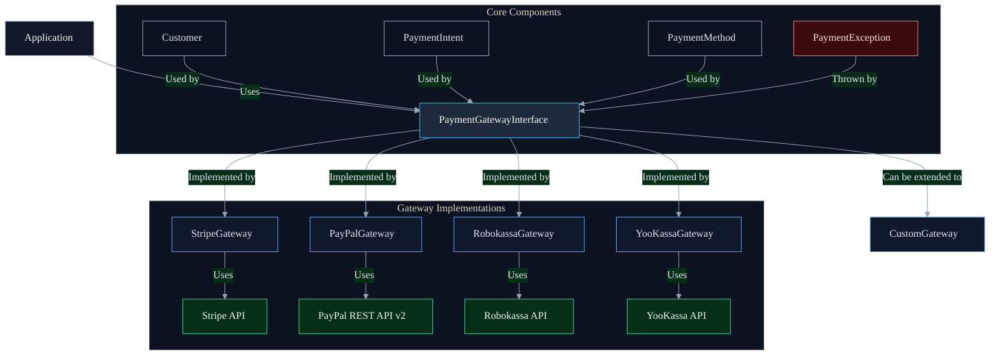
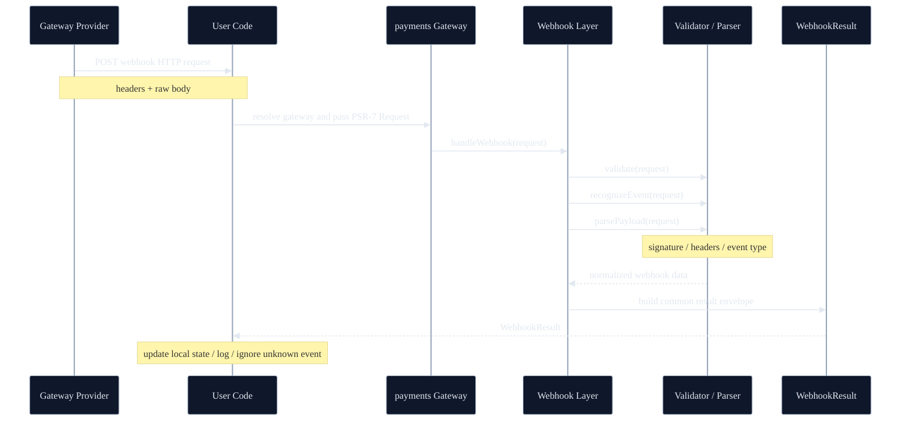

<p align="center">
    <a href="https://github.com/yiisoft" target="_blank">
        
    </a>
    <h1 align="center">Yii Payment Gateway</h1>
    <br>
</p>

[](https://packagist.org/packages/yiisoft/payments)
[](https://packagist.org/packages/yiisoft/payments)
[](https://github.com/yiisoft/payments/actions/workflows/build.yml?query=branch%3Ama)
[](https://codecov.io/gh/yiisoft/payments)
[](https://dashboard.stryker)
[](https://github.com/yiisoft/payments/actions/workflows/static.yml?query=branch)
[](https://shepherd.dev/github/yiisoft/payments)
[](https://shepherd.dev/github/yiisoft/payments)

A modern PHP 8.1+ library providing a unified interface for multiple payment gateways, with support for Stripe, PayPal (REST API v2), Robokassa and YooKassa.

## Requirements

- PHP 8.1 or higher.

## Installation

The package could be installed with [Composer](https://getcomposer.org):

```shell
composer require yiisoft/payments
```

## How it Works



The library provides a unified interface for multiple payment gateways, with each gateway implementing the `PaymentGatewayInterface`. The main components are:

- **PaymentGatewayInterface**: Defines the common API for all payment gateways
- **AbstractGateway**: Base class with shared functionality
- **Gateway-specific implementations**: `StripeGateway`, `PayPalGateway`, `RobokassaGateway`, `YooKassaGateway`
- **Data Models**: `Customer`, `PaymentIntent`, `PaymentMethod` for type-safe operations

## Features

- **Unified API** - Single interface for multiple payment providers
- **Type Safety** - Strictly typed models and responses
- **PSR Standards** - Follows PSR-4, PSR-7, PSR-17, and PSR-18
- **Extensible** - Easy to add new payment gateways
- **Modern PHP** - Requires PHP 8.1+ with strict types and readonly properties

## Payment Flow

### 1. Core Concepts

#### Customer
Represents a customer in the payment system. Contains:
- `id`: Unique identifier in the payment system
- `email`: Customer's email address
- `name`: Customer's full name
- `metadata`: Additional custom data

```php
$customer = new Customer(
    id: 'cus_123', // null for new customers
    email: 'customer@example.com',
    name: 'John Doe',
    metadata: ['user_id' => 42]
);
```

#### Payment Method
Represents how a customer will pay (credit card, PayPal, etc.). Contains:
- `id`: Unique identifier
- `type`: Payment method type (e.g., 'card', 'paypal')
- `details`: Payment method specific data (last4, brand, etc.)
- `customerId`: Reference to the customer
- `billingDetails`: Billing details (name, email, address, etc.)

```php
use Yiisoft\Payments\Models\PaymentMethod;
use Yiisoft\Payments\Models\PaymentMethodType;

$paymentMethod = new PaymentMethod(
    id: 'pm_123',
    type: PaymentMethodType::CARD,
    details: [
        'last4' => '4242',
        'brand' => 'visa',
        'exp_month' => 12,
        'exp_year' => 2025,
    ],
    customerId: 'cus_123',
    billingDetails: [
        'name' => 'John Doe',
        'email' => 'john.doe@example.com',
        'address' => [
            'line1' => '123 Main St',
            'city' => 'San Francisco',
            'state' => 'CA',
            'postal_code' => '94105',
            'country' => 'US',
        ],
    ],
);

// Available payment method types:
// - PaymentMethodType::CARD
// - PaymentMethodType::PAYPAL
// - PaymentMethodType::SEPA_DEBIT

// Check if a payment method type is valid
$isValid = PaymentMethodType::isValid('card'); // true

// Get all available payment method types
$allTypes = PaymentMethodType::all();
```

#### Payment Intent
Represents a single payment transaction. Contains:
- `id`: Unique identifier
- `amount`: Amount in smallest currency unit (e.g., cents)
- `currency`: 3-letter ISO currency code
- `status`: Current status (e.g., 'requires_payment_method', 'succeeded')
- `customerId`: Reference to the customer
- `paymentMethodId`: Reference to the payment method
- `metadata`: Additional custom data

```php
$intent = new PaymentIntent(
    id: 'pi_123', // null for new intents
    amount: 1000, // $10.00
    currency: 'usd',
    status: 'requires_payment_method',
    customerId: 'cus_123',
    paymentMethodId: 'pm_123',
    metadata: ['order_id' => 'abc123']
);
```

### 2. Payment Flow Steps

#### Step 1: Initialize the Gateway
```php
$gateway = new StripeGateway(
    apiKey: 'your_stripe_key',
    httpClient: $httpClient,
    requestFactory: $requestFactory,
    streamFactory: $streamFactory
);
```

#### Custom API endpoints

Each gateway has a small endpoints value object that allows overriding vendor base URLs (useful for stubs, proxies or alternative environments).

```php
use Yiisoft\Payments\Endpoints\StripeEndpoints;
use Yiisoft\Payments\Endpoints\PayPalEndpoints;
use Yiisoft\Payments\Endpoints\RobokassaEndpoints;
use Yiisoft\Payments\Endpoints\YooKassaEndpoints;

$stripe = new StripeGateway(
    apiKey: 'your_stripe_key',
    httpClient: $httpClient,
    requestFactory: $requestFactory,
    streamFactory: $streamFactory,
    endpoints: new StripeEndpoints(baseUri: 'https://proxy.example/stripe/v1'),
);

$paypal = new PayPalGateway(
    clientId: 'your_client_id',
    clientSecret: 'your_client_secret',
    sandbox: true,
    httpClient: $httpClient,
    requestFactory: $requestFactory,
    streamFactory: $streamFactory,
    endpoints: new PayPalEndpoints(
        sandboxBaseUri: 'https://api-m.sandbox.paypal.com',
        liveBaseUri: 'https://api-m.paypal.com',
    ),
);

$robokassa = new RobokassaGateway(
    merchantLogin: 'demo',
    password1: 'pass1',
    password2: 'pass2',
    password3: 'pass3',
    testMode: true,
    httpClient: $httpClient,
    requestFactory: $requestFactory,
    streamFactory: $streamFactory,
    endpoints: new RobokassaEndpoints(
        invoiceApiBaseUri: 'https://services.robokassa.ru/InvoiceServiceWebApi/api',
        refundApiBaseUri: 'https://services.robokassa.ru/RefundService/Refund',
        xmlApiBaseUri: 'https://auth.robokassa.ru/Merchant/WebService/Service.asmx',
    ),
);

$yookassa = new YooKassaGateway(
    shopId: 'your_shop_id',
    secretKey: 'your_secret_key',
    httpClient: $httpClient,
    requestFactory: $requestFactory,
    streamFactory: $streamFactory,
    endpoints: new YooKassaEndpoints(baseUri: 'https://api.yookassa.ru/v3'),
);
```

#### Step 2: Create or Retrieve Customer
```php
// Create new customer
$customer = $gateway->createCustomer(new Customer(
    email: 'customer@example.com',
    name: 'John Doe'
));

// Or retrieve existing customer
$customer = $gateway->retrieveCustomer('cus_existing123');
```

#### Step 3: Collect Payment Method (Frontend)
```javascript
// Example using Stripe.js
const { paymentMethod, error } = await stripe.createPaymentMethod({
  type: 'card',
  card: elements.getElement(CardElement)
});

// Send paymentMethod.id to your server
```

#### Step 4: Attach Payment Method (Server-Side)
```php
// If your frontend already created a payment method (e.g. via Stripe.js),
// you can simply attach it to the customer:
$paymentMethod = $gateway->attachPaymentMethod(
    $_POST['payment_method_id'],
    $customer->id,
);
```

#### Step 5: Create Payment Intent
```php
$intent = $gateway->createPaymentIntent(new PaymentIntent(
    amount: 1000, // $10.00
    currency: 'usd',
    customerId: $customer->id,
    paymentMethodId: $paymentMethod->id,
    metadata: ['order_id' => 'abc123']
));
```

#### Step 6: Confirm Payment (Client-Side)
```javascript
const { error, paymentIntent } = await stripe.confirmCardPayment(
  '{{ $intent->clientSecret }}',
  {
    payment_method: '{{ $paymentMethod->id }}',
    receipt_email: 'customer@example.com',
  }
);

if (error) {
  // Handle error
} else if (paymentIntent.status === 'succeeded') {
  // Payment succeeded!
}
```

#### Step 7: Webhooks (optional)
This library does not include webhook signature verification or event parsing.
Handle webhooks in your application using the provider's official documentation/SDK.


### 3. Handling Different Statuses

Payment Intents can have these statuses:
- `requires_payment_method`: Customer needs to add a payment method
- `requires_confirmation`: Payment needs to be confirmed
- `requires_action`: Customer needs to complete additional actions (3D Secure, etc.)
- `processing`: Payment is being processed
- `requires_capture`: Payment is authorized and needs to be captured
- `canceled`: Payment was canceled
- `succeeded`: Payment was successful

### 4. Refunds

```php
$refund = $gateway->createRefund('pi_123', [
    'amount' => 1000, // Optional: partial refund
    'reason' => 'requested_by_customer'
]);
```

### 5. Error Handling

Always wrap payment operations in try-catch blocks:

```php
try {
    $intent = $gateway->createPaymentIntent($paymentIntent);
} catch (PaymentException $e) {
    // Handle specific error types
    switch ($e->errorCode) {
        case 'card_declined':
            // Handle card decline
            break;
        case 'insufficient_funds':
            // Handle insufficient funds
            break;
        default:
            // Handle other errors
    }
}
```

## Usage

### Initializing a Gateway

The library relies on PSR-18 (HTTP client) and PSR-17 (request/stream factories).
In the examples below we use `symfony/http-client` and `nyholm/psr7`, but you can use any compatible implementations.

#### Stripe

```php
use Yiisoft\Payments\Gateways\StripeGateway;
use Symfony\Component\HttpClient\Psr18Client;
use Nyholm\Psr7\Factory\Psr17Factory;

$httpClient = new Psr18Client();      // Any PSR-18 client will work
$psr17Factory = new Psr17Factory();   // PSR-17 factories (request + stream)

$stripe = new StripeGateway(
    apiKey: 'YOUR_STRIPE_SECRET_KEY',
    httpClient: $httpClient,
    requestFactory: $psr17Factory,
    streamFactory: $psr17Factory,
);
```

#### PayPal (Checkout Orders API v2)

```php
use Yiisoft\Payments\Gateways\PayPalGateway;

// Reuse $httpClient and $psr17Factory from the Stripe example above (or provide your own PSR-18/PSR-17 implementations).
$paypal = new PayPalGateway(
    clientId: 'YOUR_CLIENT_ID',
    clientSecret: 'YOUR_CLIENT_SECRET',
    sandbox: true,
    httpClient: $httpClient,
    requestFactory: $psr17Factory,
    streamFactory: $psr17Factory,
);
```

#### Robokassa

```php
use Yiisoft\Payments\Gateways\RobokassaGateway;

// Reuse $httpClient and $psr17Factory from the Stripe example above (or provide your own PSR-18/PSR-17 implementations).
$robokassa = new RobokassaGateway(
    merchantLogin: 'YOUR_MERCHANT_LOGIN',
    password1: 'YOUR_PASSWORD_1', // Invoice API (JWT signing)
    password2: 'YOUR_PASSWORD_2', // XML status API (OpStateExt)
    password3: 'YOUR_PASSWORD_3', // Refund API v2 (JWT signing). Set to null if you don't need refunds.
    testMode: true,
    httpClient: $httpClient,
    requestFactory: $psr17Factory,
    streamFactory: $psr17Factory,
);
```


### Working with Customers

```php
use Yiisoft\Payments\Models\Customer;

// Create a customer
$customer = $gateway->createCustomer(new Customer(
    email: 'customer@example.com',
    name: 'John Doe',
    metadata: ['user_id' => 42],
));

// Retrieve a customer
$customer = $gateway->retrieveCustomer($customer->id);

// Update a customer (models are readonly, create a new instance)
$customer = $gateway->updateCustomer(new Customer(
    id: $customer->id,
    email: 'new.email@example.com',
    name: $customer->name,
    phone: $customer->phone,
    address: $customer->address,
    metadata: $customer->metadata,
    description: $customer->description,
));

// Delete a customer
$gateway->deleteCustomer($customer->id);
```

### Working with Payment Methods

```php
use Yiisoft\Payments\Models\PaymentMethod;
use Yiisoft\Payments\Models\PaymentMethodType;

// Note: payment method payload is gateway-specific.
// For card payments you should avoid handling raw card data on your server.
// Use provider tokenization (e.g. Stripe.js) whenever possible.

$paymentMethod = $gateway->createPaymentMethod(new PaymentMethod(
    type: PaymentMethodType::CARD,
    details: [
        // Example (Stripe): pass a token created on the client side.
        // The gateway will send it under the "card" key because type === "card".
        'token' => 'tok_visa',
    ],
    customerId: $customer->id,
));

$paymentMethod = $gateway->attachPaymentMethod($paymentMethod->id, $customer->id);
```

### Processing Payments

```php
use Yiisoft\Payments\Models\PaymentIntent;

// Create a payment intent / order / invoice (gateway-specific)
$intent = $gateway->createPaymentIntent(new PaymentIntent(
    amount: 1000,          // in the smallest currency unit (e.g. cents)
    currency: 'USD',
    customerId: $customer->id,
    paymentMethodId: $paymentMethod->id,
    description: 'Order #123',
    metadata: ['order_id' => '123'],
));

// Some gateways (PayPal, Robokassa) require a customer approval step via redirect URL:
$redirectUrl = $intent->nextAction['redirect_to_url']['url'] ?? null;

// Capture the payment (only for gateways/flows that support delayed capture)
if ($intent->status === PaymentIntent::STATUS_REQUIRES_CAPTURE) {
    $intent = $gateway->capturePaymentIntent($intent->id);
}

// Refund
$refund = $gateway->createRefund($intent->id, [
    'amount' => 1000, // optional partial refund
    'reason' => 'requested_by_customer',
]);
```

## Available Gateways

### Stripe (`StripeGateway`)

- Customers
- Payment Methods (create + attach)
- Payment Intents (create / retrieve / confirm / capture / cancel)
- Refunds

> Webhook verification/event parsing is intentionally out of scope for this library. Implement it in your application using Stripe docs/SDK.

### PayPal (`PayPalGateway`) — REST API v2 (Checkout Orders)

- Payment Intents are mapped to PayPal **Orders** (`/v2/checkout/orders`)
- `createPaymentIntent()` creates an order and may return an approval URL in `PaymentIntent::$nextAction['redirect_to_url']['url']`
- `capturePaymentIntent()` captures an order (`/v2/checkout/orders/{id}/capture`)
- `createRefund()` refunds a capture (`/v2/payments/captures/{capture_id}/refund`)

> PayPal does not expose generic Customer/PaymentMethod resources compatible with the library's models, so `Customer` / `PaymentMethod` operations are treated as lightweight placeholders (no persistent “vault” is created).

### Robokassa (`RobokassaGateway`)

- Payment Intents are mapped to Robokassa **invoices** (Invoice API JWT)
- `createPaymentIntent()` creates an invoice and returns a redirect URL in `PaymentIntent::$nextAction['redirect_to_url']['url']`
- `retrievePaymentIntent()` checks invoice status via **OpStateExt**
- `createRefund()` performs refund via **Refund API v2** (JWT)

> Robokassa customer/payment-method concepts differ from card processors, so `Customer` / `PaymentMethod` operations are implemented as placeholders for interface compatibility.

## Extending with New Gateways

To add a new payment gateway, create a class that implements `PaymentGatewayInterface`.
For convenience you can extend `Yiisoft\Payments\Gateways\AbstractGateway`, which provides:

- JSON request/response handling (PSR-18 + PSR-17)
- basic error-to-exception mapping (`PaymentException`, `InvalidRequestException`)
- a helper to build requests: `createRequest()`
- a helper to send and decode responses: `sendRequest()`

Example (minimal skeleton):

```php
<?php

declare(strict_types=1);

namespace App\Payment\Gateways;

use Yiisoft\Payments\Gateways\AbstractGateway;
use Yiisoft\Payments\Models\Customer;
use Yiisoft\Payments\Models\PaymentIntent;
use Yiisoft\Payments\Models\PaymentMethod;
use Psr\Http\Client\ClientInterface;
use Psr\Http\Message\RequestFactoryInterface;
use Psr\Http\Message\StreamFactoryInterface;

final class AcmePayGateway extends AbstractGateway
{
    public function __construct(
        private string $apiKey,
        ClientInterface $httpClient,
        RequestFactoryInterface $requestFactory,
        StreamFactoryInterface $streamFactory,
    ) {
        parent::__construct($httpClient, $requestFactory, $streamFactory);
    }

    protected function getBaseUri(): string
    {
        return 'https://api.acmepay.com/v1';
    }

    public function createCustomer(Customer $customer): Customer
    {
        $response = $this->sendRequest(
            $this->createRequest('POST', '/customers', [
                'email' => $customer->email,
                'name' => $customer->name,
            ])
        );

        return Customer::fromArray($response);
    }

    public function createPaymentIntent(PaymentIntent $intent): PaymentIntent
    {
        $response = $this->sendRequest(
            $this->createRequest('POST', '/payment_intents', [
                'amount' => $intent->amount,
                'currency' => $intent->currency,
                'metadata' => $intent->metadata,
            ])
        );

        return PaymentIntent::fromArray($response);
    }

    // Implement the remaining methods from PaymentGatewayInterface...
    public function retrieveCustomer(string $customerId): Customer { /* ... */ }
    public function updateCustomer(Customer $customer): Customer { /* ... */ }
    public function deleteCustomer(string $customerId): void { /* ... */ }
    public function createPaymentMethod(PaymentMethod $paymentMethod): PaymentMethod { /* ... */ }
    public function attachPaymentMethod(string $paymentMethodId, string $customerId): PaymentMethod { /* ... */ }
    public function confirmPaymentIntent(string $intentId, array $params = []): PaymentIntent { /* ... */ }
    public function capturePaymentIntent(string $intentId, array $params = []): PaymentIntent { /* ... */ }
    public function cancelPaymentIntent(string $intentId, array $params = []): PaymentIntent { /* ... */ }
    public function createRefund(string $paymentIntentId, array $params = []): array { /* ... */ }
    public function retrievePaymentIntent(string $intentId): PaymentIntent { /* ... */ }
}
```


### How to use it

After implementing your gateway (for example, `AcmePayGateway` above), you can use it exactly like the built-in gateways.
Instantiate it with a PSR-18 HTTP client and PSR-17 factories, then call the methods defined by `PaymentGatewayInterface`:

```php
<?php

declare(strict_types=1);

use App\Payment\Gateways\AcmePayGateway;
use Yiisoft\Payments\Models\Customer;
use Yiisoft\Payments\Models\PaymentIntent;

// $httpClient: PSR-18 client
// $requestFactory: PSR-17 request factory
// $streamFactory: PSR-17 stream factory

$gateway = new AcmePayGateway($httpClient, $requestFactory, $streamFactory);

// 1) (Optional) Create a customer in the provider
$customer = $gateway->createCustomer(new Customer(
    email: 'buyer@example.com',
    name: 'Buyer',
));

// 2) Create a payment intent (amount is in minor units, e.g. cents)
$intent = $gateway->createPaymentIntent(new PaymentIntent(
    amount: 1999,
    currency: 'USD',
    customerId: $customer->id,
    metadata: ['order_id' => 'ORDER-1001'],
));

// 3) If the provider requires buyer approval via redirect, send the buyer to:
$approvalUrl = $intent->nextAction['redirect_to_url']['url'] ?? null;

// 4) Later (after approval), confirm / capture (if your gateway uses these steps)
$intent = $gateway->confirmPaymentIntent($intent->id);
$intent = $gateway->capturePaymentIntent($intent->id);

// 5) Refund (full or partial, depending on your gateway constraints)
$refund = $gateway->createRefund($intent->id, ['amount' => 1999]);
```

#### Minimal required methods

`PaymentGatewayInterface` requires implementing **all** methods below:

- Customer: `createCustomer()`, `retrieveCustomer()`, `updateCustomer()`, `deleteCustomer()`
- Payment methods: `createPaymentMethod()`, `attachPaymentMethod()`
- Payment intents: `createPaymentIntent()`, `retrievePaymentIntent()`, `confirmPaymentIntent()`, `capturePaymentIntent()`,
  `cancelPaymentIntent()`
- Refunds: `createRefund()`

For a gateway that only supports *payments + refunds* (and does not have a customer / payment-method concept), the minimum
you typically implement with real provider calls is:

- `createPaymentIntent()`, `retrievePaymentIntent()`, `cancelPaymentIntent()`, `createRefund()`
- plus `confirmPaymentIntent()` / `capturePaymentIntent()` **if** your provider has a multi-step confirmation/capture flow

Customer and payment-method operations can be implemented as no-ops (returning the input model) or by throwing
`PaymentException` if the provider does not support them. Document that behavior in README.


Best practices:

1. Throw `PaymentException` (or subclasses) on any gateway-side errors.
2. Use idempotency keys where the provider supports them.
3. Add unit tests with a fake/spy HTTP client, and integration tests with real credentials (optional).
4. Document any gateway-specific behavior (approval redirects, delayed capture, refund constraints).

## Documentation

- [Internals](docs/internals.md)

If you need help or have a question, the [Yii Forum](https://forum.yiiframework.com/c/yii-3-0/63) is a good place
for that. You may also check out other [Yii Community Resources](https://www.yiiframework.com/community).

## Testing

Unit tests:

```bash
vendor/bin/phpunit
```

Integration tests (PayPal / Robokassa real API exchange):

1) Install dev dependencies
2) Copy config templates and fill credentials:

```bash
cp tests/config/paypal.php.dist tests/config/paypal.php
cp tests/config/robokassa.php.dist tests/config/robokassa.php
```

3) Run integration tests (they will be skipped if config is missing):

```bash
vendor/bin/phpunit --group integration
```

## License

The Yii payments is free software. It is released under the terms of the BSD License.
Please see [`LICENSE`](./LICENSE.md) for more information.

Maintained by [Yii Software](https://www.yiiframework.com/).

## Support the project

[](https://opencollective.com/yiisoft)

## Follow updates

[](https://www.yiiframework.com/)
[](https://twitter.com/yiiframework)
[](https://t.me/yii3en)
[](https://www.facebook.com/groups/yiitalk)
[](https://yiiframework.com/go/slack)

## Proposed Release 1: Webhooks (planned)

> This section describes a **proposed** webhook API for **Release 1** and is intended for discussion in a feature branch.  
> It does **not** describe functionality that is already available in the current stable version of the library.



Release 1 webhook support is designed to add a **common, payment-oriented webhook handling layer** on top of the existing gateway API.

The main idea is:

- user code still owns the HTTP endpoint;
- the library receives a `ServerRequestInterface`;
- a gateway-specific webhook processor validates and parses the request;
- the library returns a normalized `WebhookResult`;
- Release 1 covers **payment-related webhook events only**.

### Goals of Release 1

Release 1 should provide a common way to:

- accept webhook requests from all supported gateways;
- validate request authenticity using provider-specific rules;
- recognize payment-related event kinds;
- parse the payload into normalized internal data;
- map the result to the existing `PaymentIntent` model where possible;
- expose raw request data for debugging and traceability.

### Proposed Common Contracts

The exact naming may still change during implementation, but the proposed Release 1 API is centered around the following concepts.

#### Gateway-level webhook support

```php
interface WebhookGatewayInterface extends PaymentGatewayInterface
{
    public function getWebhookHandler(): WebhookHandlerInterface;
    public function supportsWebhooks(): bool;
    public function supportsWebhookEntity(string $entityKind): bool;
}
```

This keeps webhook support close to the existing gateway model while making support explicit.

#### Main webhook entry point

```php
use Psr\Http\Message\ServerRequestInterface;

interface WebhookHandlerInterface
{
    public function handleWebhook(ServerRequestInterface $request): WebhookResult;
}
```

This is the common entry point for user code.

#### Validation

```php
use Psr\Http\Message\ServerRequestInterface;

interface WebhookValidatorInterface
{
    public function validate(ServerRequestInterface $request): WebhookValidationResult;
}
```

Validation remains provider-specific because each payment system uses its own signature, headers, and verification rules.

#### Event recognition

```php
use Psr\Http\Message\ServerRequestInterface;

interface WebhookEventRecognizerInterface
{
    public function recognizeEvent(ServerRequestInterface $request): string;
    public function recognizeRawEventName(ServerRequestInterface $request): ?string;
}
```

This separates the normalized event kind from the original provider event name.

#### Payload parsing

```php
use Psr\Http\Message\ServerRequestInterface;

interface WebhookPayloadParserInterface
{
    public function parsePayload(ServerRequestInterface $request): WebhookPayload;
}
```

The parser converts the raw request into normalized internal webhook data.

#### Mapping to payment-related models

```php
interface PaymentWebhookMapperInterface
{
    public function mapPaymentIntent(WebhookPayload $payload): ?PaymentIntent;
    public function extractPaymentStatus(WebhookPayload $payload): ?string;
}
```

Release 1 is intentionally limited to `PaymentIntent`-oriented webhook handling.

### Proposed Result Objects

#### Validation result

```php
final readonly class WebhookValidationResult
{
    public function __construct(
        public bool $isValid,
        public ?string $reason = null,
    ) {
    }
}
```

#### Parsed payload

```php
final readonly class WebhookPayload
{
    public function __construct(
        public string $entityKind,
        public ?string $rawEventName,
        public array $data,
        public string $rawBody,
        public array $headers = [],
    ) {
    }
}
```

#### Final result returned to user code

```php
final readonly class WebhookResult
{
    public function __construct(
        public bool $isValid,
        public string $entityKind,
        public ?string $rawEventName = null,
        public ?string $paymentStatus = null,
        public ?PaymentIntent $paymentIntent = null,
        public ?string $failureReason = null,
        public string $rawBody = '',
        public array $headers = [],
        public array $providerData = [],
    ) {
    }
}
```

`WebhookResult` is intended to be the main value returned from `handleWebhook()`.

### Example: Common user-code flow

In a typical web application, the HTTP endpoint belongs to the application layer.
The application resolves the gateway for the current webhook endpoint and then passes the incoming PSR-7 request to the library.

```php
use Psr\Http\Message\ResponseFactoryInterface;
use Psr\Http\Message\ResponseInterface;
use Psr\Http\Message\ServerRequestInterface;
use Yiisoft\Payments\Webhooks\WebhookEntityKind;
use Yiisoft\Payments\Webhooks\WebhookGatewayInterface;

final class StripeWebhookController
{
    public function __construct(
        private WebhookGatewayInterface $gateway,
        private ResponseFactoryInterface $responseFactory,
    ) {
    }

    public function __invoke(ServerRequestInterface $request): ResponseInterface
    {
        if (!$this->gateway->supportsWebhooks()) {
            return $this->responseFactory->createResponse(501);
        }

        $result = $this->gateway->getWebhookHandler()->handleWebhook($request);

        if (!$result->isValid) {
            return $this->responseFactory->createResponse(400);
        }

        if ($result->entityKind !== WebhookEntityKind::PAYMENT) {
            return $this->responseFactory->createResponse(200);
        }

        $intent = $result->paymentIntent;
        $status = $result->paymentStatus;

        // Application-specific logic goes here:
        // - update local payment state
        // - write audit logs
        // - ignore unknown or unsupported events

        return $this->responseFactory->createResponse(200);
    }
}
```

A typical application would expose a dedicated route per payment system, for example `/webhooks/stripe`, `/webhooks/paypal`, `/webhooks/robokassa` and `/webhooks/yookassa`.
Because the route is already tied to one provider, the application already knows which gateway instance to inject into the controller/handler.
The `payments` library only processes the provider-specific webhook request and returns a normalized result.


### Example: Capability checks

```php
use Yiisoft\Payments\Webhooks\WebhookEntityKind;
use Yiisoft\Payments\Webhooks\WebhookGatewayInterface;

/** @var WebhookGatewayInterface $gateway */

if (
    $gateway->supportsWebhooks()
    && $gateway->supportsWebhookEntity(WebhookEntityKind::PAYMENT)
) {
    $result = $gateway->getWebhookHandler()->handleWebhook($request);
}
```

### Why Release 1 is limited to payment events

Release 1 focuses on payment-related webhook handling because it fits the current public API more naturally:

- the library already has a common `PaymentIntent` model;
- refund handling is currently less symmetrical than payment flows;
- subscription / recurring support is even more provider-specific and should be introduced separately.

This makes Release 1 useful immediately while keeping the public API easier to stabilize.

### Out of Scope for Release 1

Release 1 should **not** include:

- refund webhook normalization;
- subscription / recurring webhook normalization;
- framework controllers or route wiring;
- persistence of webhook events;
- retry queues or delivery orchestration;
- business-side order processing;
- outgoing webhook support;
- a guarantee that every provider event maps to a common object.

### Notes for future releases

A possible next-step sequence after Release 1 is:

1. **Release 2** — refund webhook support;
2. **Release 3** — subscription / recurring webhook support;
3. **Release 4** — webhook API polish and advanced usability.

This sequence keeps each release independently useful while reducing the risk of breaking the public API later.
