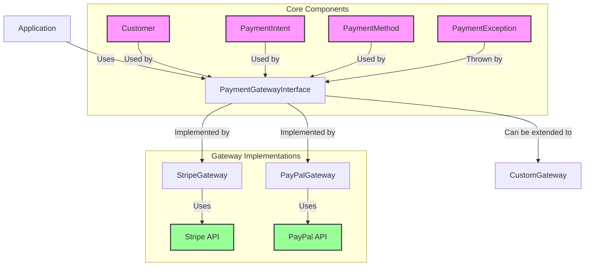

<p align="center">
    <a href="https://github.com/yiisoft" target="_blank">
        
    </a>
    <h1 align="center">Yii Payment Gateway</h1>
    <br>
</p>

[](https://packagist.org/packages/yiisoft/payments)
[](https://packagist.org/packages/yiisoft/payments)
[](https://github.com/yiisoft/payments/actions/workflows/build.yml?query=branch%3Ama)
[](https://codecov.io/gh/yiisoft/payments)
[](https://dashboard.stryker)
[](https://github.com/yiisoft/payments/actions/workflows/static.yml?query=branch)
[](https://shepherd.dev/github/yiisoft/payments)
[](https://shepherd.dev/github/yiisoft/payments)

A modern PHP 8.4+ library providing a unified interface for multiple payment gateways, with first-class support for Stripe and PayPal.

## Requirements

- PHP 8.2 or higher.

## Installation

The package could be installed with [Composer](https://getcomposer.org):

```shell
composer require yiisoft/payments
```

## How it Works



The library provides a unified interface for multiple payment gateways, with each gateway implementing the `PaymentGatewayInterface`. The main components are:

- **PaymentGatewayInterface**: Defines the common API for all payment gateways
- **AbstractGateway**: Base class with shared functionality
- **Gateway-specific implementations**: Classes like `StripeGateway` and `PayPalGateway`
- **Data Models**: `Customer`, `PaymentIntent`, `PaymentMethod` for type-safe operations

## Features

- **Unified API** - Single interface for multiple payment providers
- **Type Safety** - Strictly typed models and responses
- **PSR Standards** - Follows PSR-4, PSR-7, PSR-17, and PSR-18
- **Extensible** - Easy to add new payment gateways
- **Modern PHP** - Requires PHP 8.4+ with strict types and readonly properties

## Payment Flow

### 1. Core Concepts

#### Customer
Represents a customer in the payment system. Contains:
- `id`: Unique identifier in the payment system
- `email`: Customer's email address
- `name`: Customer's full name
- `metadata`: Additional custom data

```php
$customer = new Customer(
    id: 'cus_123', // null for new customers
    email: 'customer@example.com',
    name: 'John Doe',
    metadata: ['user_id' => 42]
);
```

#### Payment Method
Represents how a customer will pay (credit card, PayPal, etc.). Contains:
- `id`: Unique identifier
- `type`: Payment method type (e.g., 'card', 'paypal')
- `details`: Payment method specific data (last4, brand, etc.)
- `customerId`: Reference to the customer
- `billingDetails`: Billing details (name, email, address, etc.)

```php
use Yiisoft\Payments\Models\PaymentMethod;
use Yiisoft\Payments\Models\PaymentMethodType;

$paymentMethod = new PaymentMethod(
    id: 'pm_123',
    type: PaymentMethodType::CARD,
    details: [
        'last4' => '4242',
        'brand' => 'visa',
        'exp_month' => 12,
        'exp_year' => 2025,
    ],
    customerId: 'cus_123',
    billingDetails: [
        'name' => 'John Doe',
        'email' => 'john.doe@example.com',
        'address' => [
            'line1' => '123 Main St',
            'city' => 'San Francisco',
            'state' => 'CA',
            'postal_code' => '94105',
            'country' => 'US',
        ],
    ],
);

// Available payment method types:
// - PaymentMethodType::CARD
// - PaymentMethodType::PAYPAL
// - PaymentMethodType::SEPA_DEBIT

// Check if a payment method type is valid
$isValid = PaymentMethodType::isValid('card'); // true

// Get all available payment method types
$allTypes = PaymentMethodType::all();
```

#### Payment Intent
Represents a single payment transaction. Contains:
- `id`: Unique identifier
- `amount`: Amount in smallest currency unit (e.g., cents)
- `currency`: 3-letter ISO currency code
- `status`: Current status (e.g., 'requires_payment_method', 'succeeded')
- `customerId`: Reference to the customer
- `paymentMethodId`: Reference to the payment method
- `metadata`: Additional custom data

```php
$intent = new PaymentIntent(
    id: 'pi_123', // null for new intents
    amount: 1000, // $10.00
    currency: 'usd',
    status: PaymentIntentStatus::RequiresPaymentMethod,
    customerId: 'cus_123',
    paymentMethodId: 'pm_123',
    metadata: ['order_id' => 'abc123']
);
```

### 2. Payment Flow Steps

#### Step 1: Initialize the Gateway
```php
$gateway = new StripeGateway(
    apiKey: 'your_stripe_key',
    httpClient: $httpClient,
    requestFactory: $requestFactory,
    streamFactory: $streamFactory
);
```

#### Step 2: Create or Retrieve Customer
```php
// Create new customer
$customer = $gateway->createCustomer(new Customer(
    email: 'customer@example.com',
    name: 'John Doe'
));

// Or retrieve existing customer
$customer = $gateway->retrieveCustomer('cus_existing123');
```

#### Step 3: Collect Payment Method (Frontend)
```javascript
// Example using Stripe.js
const { paymentMethod, error } = await stripe.createPaymentMethod({
  type: 'card',
  card: elements.getElement(CardElement)
});

// Send paymentMethod.id to your server
```

#### Step 4: Create Payment Method
```php
$paymentMethod = $gateway->createPaymentMethod(new PaymentMethod(
    id: $_POST['payment_method_id'],
    type: PaymentMethodType::Card,
    customerId: $customer->id
));
```

#### Step 5: Create Payment Intent
```php
$intent = $gateway->createPaymentIntent(new PaymentIntent(
    amount: 1000, // $10.00
    currency: 'usd',
    customerId: $customer->id,
    paymentMethodId: $paymentMethod->id,
    metadata: ['order_id' => 'abc123']
));
```

#### Step 6: Confirm Payment (Client-Side)
```javascript
const { error, paymentIntent } = await stripe.confirmCardPayment(
  '{{ $intent->clientSecret }}',
  {
    payment_method: '{{ $paymentMethod->id }}',
    receipt_email: 'customer@example.com',
  }
);

if (error) {
  // Handle error
} else if (paymentIntent.status === 'succeeded') {
  // Payment succeeded!
}
```

#### Step 7: Handle Webhook Events
```php
$event = $gateway->parseWebhookEvent($request->getBody());

switch ($event->type) {
    case 'payment_intent.succeeded':
        $paymentIntent = $event->data->object;
        // Update your database, send confirmation email, etc.
        break;
    case 'payment_intent.payment_failed':
        $paymentIntent = $event->data->object;
        // Log failure, notify customer
        break;
}
```

### 3. Handling Different Statuses

Payment Intents can have these statuses:
- `requires_payment_method`: Customer needs to add a payment method
- `requires_confirmation`: Payment needs to be confirmed
- `requires_action`: Customer needs to complete additional actions (3D Secure, etc.)
- `processing`: Payment is being processed
- `requires_capture`: Payment is authorized and needs to be captured
- `canceled`: Payment was canceled
- `succeeded`: Payment was successful

### 4. Refunds

```php
$refund = $gateway->createRefund('pi_123', [
    'amount' => 1000, // Optional: partial refund
    'reason' => 'requested_by_customer'
]);
```

### 5. Error Handling

Always wrap payment operations in try-catch blocks:

```php
try {
    $intent = $gateway->createPaymentIntent($paymentIntent);
} catch (PaymentException $e) {
    // Handle specific error types
    switch ($e->errorCode) {
        case 'card_declined':
            // Handle card decline
            break;
        case 'insufficient_funds':
            // Handle insufficient funds
            break;
        default:
            // Handle other errors
    }
}
```

## Usage

### Initializing a Gateway

#### Stripe

```php
use PaymentGateway\Gateways\StripeGateway;
use GuzzleHttp\Client;
use Nyholm\Psr7\Factory\Psr17Factory;

$httpClient = new Client();
$requestFactory = new Psr17Factory();
$streamFactory = $requestFactory;

$stripe = new StripeGateway(
    'your-stripe-secret-key',
    $httpClient,
    $requestFactory,
    $streamFactory
);
```

#### PayPal

```php
use PaymentGateway\Gateways\PayPalGateway;

$paypal = new PayPalGateway(
    'your-paypal-client-id',
    'your-paypal-secret',
    true, // sandbox mode
    $httpClient,
    $requestFactory,
    $streamFactory
);
```

### Working with Customers

```php
// Create a customer
$customer = new \PaymentGateway\Models\Customer(
    null, // id will be generated by the gateway
    'customer@example.com',
    'John Doe'
);

$createdCustomer = $gateway->createCustomer($customer);

// Retrieve a customer
$customer = $gateway->retrieveCustomer('cus_123');

// Update a customer
$customer->setEmail('new.email@example.com');
$updatedCustomer = $gateway->updateCustomer($customer);

// Delete a customer
$gateway->deleteCustomer('cus_123');
```

### Working with Payment Methods

```php
// Create a payment method (e.g., card)
$paymentMethod = new \PaymentGateway\Models\PaymentMethod(
    null, // id will be generated by the gateway
    \Yiisoft\Payments\Enums\PaymentMethodType::Card,
    [
        'number' => '4242424242424242',
        'exp_month' => '12',
        'exp_year' => '2025',
        'cvc' => '123',
    ]
);

$createdMethod = $gateway->createPaymentMethod($paymentMethod);

// Attach to a customer
$attachedMethod = $gateway->attachPaymentMethod(
    $createdMethod->getId(),
    'cus_123'
);
```

### Processing Payments

```php
// Create a payment intent
$intent = new \PaymentGateway\Models\PaymentIntent(
    null, // id will be generated
    null, // status will be set by the gateway
    1000, // $10.00
    'usd',
    'cus_123',
    'pm_123',
    null, // client secret
    'Order #123',
    ['order_id' => '123']
);

// Create and confirm the payment
$createdIntent = $gateway->createPaymentIntent($intent);

// Capture the payment (if not captured automatically)
if ($createdIntent->getStatus() === 'requires_capture') {
    $capturedIntent = $gateway->capturePaymentIntent($createdIntent->getId());
}

// Refund a payment
$refund = $gateway->createRefund($capturedIntent->getId(), [
    'amount' => 1000,
    'reason' => 'requested_by_customer'
]);
```

## Available Gateways

### Stripe

Full support for Stripe's payment processing features including:
- Customers
- Payment Methods (Cards, SEPA, etc.)
- Payment Intents
- Refunds
- Webhook handling (via separate event handling)

### PayPal

Support for PayPal's REST API including:
- Orders API
- Payments API
- Payouts
- Webhooks

## Extending with New Gateways

To add a new payment gateway, follow these steps:

1. Create a new class that implements `PaymentGatewayInterface`
2. Extend `AbstractGateway` for common functionality
3. Implement the required methods for your gateway

Here's an example of creating a custom gateway for a hypothetical "AcmePay" payment processor:

```php
<?php

declare(strict_types=1);

namespace App\Payment\Gateways;

use Yiisoft\PaymentGateway\Core\Models\Customer;
use Yiisoft\PaymentGateway\Core\Models\PaymentIntent;
use Yiisoft\PaymentGateway\Core\Models\PaymentMethod;
use Yiisoft\PaymentGateway\Gateways\AbstractGateway;
use Psr\Http\Client\ClientInterface;
use Psr\Http\Message\RequestFactoryInterface;
use Psr\Http\Message\StreamFactoryInterface;
use Psr\Log\LoggerInterface;use Yiisoft\Payments\Enums\PaymentIntentStatus;

final class AcmePayGateway extends AbstractGateway
{
    public function __construct(
        private string $apiKey,
        private bool $sandbox = false,
        ?ClientInterface $httpClient = null,
        ?RequestFactoryInterface $requestFactory = null,
        ?StreamFactoryInterface $streamFactory = null,
        ?LoggerInterface $logger = null
    ) {
        parent::__construct($httpClient, $requestFactory, $streamFactory, $logger);
    }

    protected function getBaseUri(): string
    {
        return $this->sandbox 
            ? 'https://api.sandbox.acmepay.com/v1' 
            : 'https://api.acmepay.com/v1';
    }

    public function createCustomer(Customer $customer): Customer
    {
        $response = $this->sendRequest(
            $this->createRequest('POST', '/customers', [
                'email' => $customer->email,
                'name' => $customer->name,
            ])
        );

        return new Customer(
            id: $response['id'],
            email: $customer->email,
            name: $customer->name
        );
    }

    public function createPaymentIntent(PaymentIntent $intent): PaymentIntent
    {
        $response = $this->sendRequest(
            $this->createRequest('POST', '/payment_intents', [
                'amount' => $intent->amount,
                'currency' => $intent->currency,
                'customer' => $intent->customerId,
                'payment_method' => $intent->paymentMethodId,
                'metadata' => $intent->metadata,
            ])
        );

        return new PaymentIntent(
            id: $response['id'],
            status: PaymentIntentStatus::tryFrom($response['status']),
            amount: $intent->amount,
            currency: $intent->currency,
            customerId: $intent->customerId,
            paymentMethodId: $intent->paymentMethodId,
            metadata: $intent->metadata,
        );
    }

    // Implement other required methods...
}
```

Now to use it:

```php
use App\Payment\Gateways\AcmePayGateway;
use Yiisoft\PaymentGateway\Core\Models\Customer;
use Yiisoft\PaymentGateway\Core\Models\PaymentIntent;

// Initialize the gateway
$gateway = new AcmePayGateway(
    apiKey: 'your_api_key_here',
    sandbox: true, // Use sandbox for testing
    httpClient: $httpClient, // PSR-18 HTTP Client
    requestFactory: $requestFactory, // PSR-17 Request Factory
    streamFactory: $streamFactory // PSR-17 Stream Factory
);

// Create a customer
$customer = $gateway->createCustomer(new Customer(
    email: 'customer@example.com',
    name: 'John Doe'
));

// Create a payment intent
$intent = $gateway->createPaymentIntent(new PaymentIntent(
    amount: 1000, // $10.00
    currency: 'usd',
    customerId: $customer->id,
    paymentMethodId: 'acme_card_123',
    metadata: ['order_id' => '12345']
));
```

When creating a new gateway, you'll need to implement these methods at minimum:

- `createCustomer(Customer $customer): Customer`
- `updateCustomer(Customer $customer): Customer`
- `createPaymentIntent(PaymentIntent $intent): PaymentIntent`
- `createPaymentMethod(PaymentMethod $method): PaymentMethod`
- `createRefund(string $paymentIntentId, array $params = []): array`

There are some best practices to follow:

1. **Error Handling**: Always throw appropriate exceptions (`PaymentException` or its subclasses) for payment-related errors
2. **Testing**: Create unit tests for your gateway implementation
3. **Logging**: Use the injected logger to log important events and errors
4. **Documentation**: Document any gateway-specific behavior or requirements
5. **Idempotency**: Make requests idempotent where possible to handle retries safely

## Documentation

- [Internals](docs/internals.md)

If you need help or have a question, the [Yii Forum](https://forum.yiiframework.com/c/yii-3-0/63) is a good place
for that. You may also check out other [Yii Community Resources](https://www.yiiframework.com/community).

## License

The Yii payments is free software. It is released under the terms of the BSD License.
Please see [`LICENSE`](./LICENSE.md) for more information.

Maintained by [Yii Software](https://www.yiiframework.com/).

## Support the project

[](https://opencollective.com/yiisoft)

## Follow updates

[](https://www.yiiframework.com/)
[](https://twitter.com/yiiframework)
[](https://t.me/yii3en)
[](https://www.facebook.com/groups/yiitalk)
[](https://yiiframework.com/go/slack)
